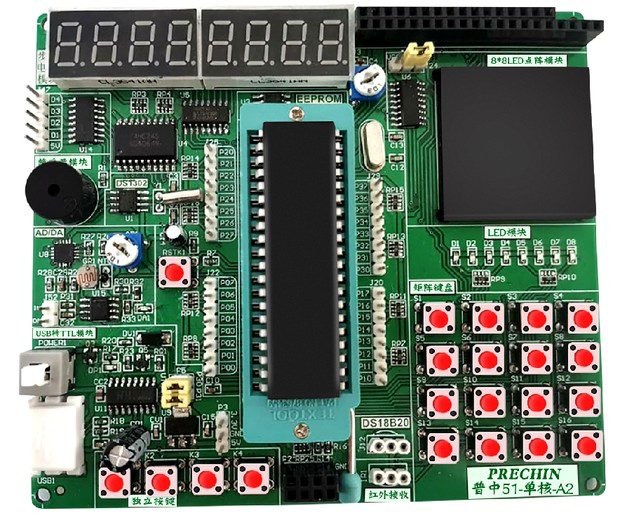
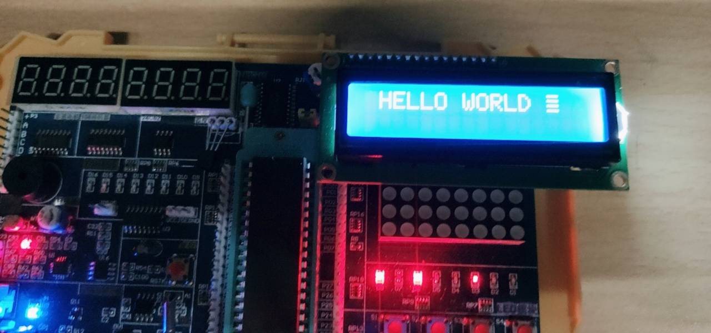

# 聪聪的普中 51-单核-A2 开发板 学习~

[](https://github.com/yujiecong/yjc-c51-A2-learning)

_开新坑了，又是新的51！！哈哈哈  原来的[BST-C51单片机在这里](https://github.com/yujiecong/yjc-BST-M51-learning)_
接着就是一些小改动,[原理图放这里了](A2开发板原理图.pdf)
***
本仓库包含以下内容：

1. 废物的单片机挣扎
2. 和前面[BST-C51](https://github.com/yujiecong/yjc-BST-M51-learning)的联动学习

## 内容列表
- [更新](#更新)
- [与BST-C51的差异](#与BST-C51的差异)
- [背景](#背景)
- [安装](#安装)
- [示例](#示例)
- [相关仓库](#相关仓库)
- [维护者](#维护者)
- [如何贡献](#如何贡献)
- [使用许可](#使用许可)
## 更新
- 2020年10月14日22:46:49 决定搁置这里了，有缘再见
- 2020年10月14日18:40:09 今天白弄一天，因为c51结构体指针有bug..
- 2020年10月13日00:20:27 update [函数封装](./contents/my-experiment)
- 2020年10月12日17:26:49 添加了一堆[函数封装](./contents/my-experiment)，待更新
- 2020年10月11日14:59:02 更新chapter 20
- 2020年10月10日20:51:15 更新chapter 19
- 2020年10月10日18:55:22 update [contents](https://github.com/yujiecong/yjc-PrechinA2-learning/tree/master/contents)
- 2020年10月9日12:17:54 3天的堕落，更新18chapter
- 2020年10月5日16:40:07 17chapter温度传感器
- 2020年10月5日13:27:48 网络问题，现在才更新，更到了16章
- 2020年10月4日13:32:16 更新综合测试秒表
- 2020年10月3日15:37:44 更新至15章，好累，休息去了
- 2020年10月3日12:50:40 更新第十章
- 2020年10月3日10:51:09 更新八九章，解决了这个[issue](https://github.com/yujiecong/yjc-c51-A2-learning/issues)，有了更深入的理解
- 2020年10月2日16:49:08 更新到第八九章，因为不会接线卡住了哈哈哈，提交了一个[issue](https://github.com/yujiecong/yjc-c51-A2-learning/issues)
- 2020年10月1日18:13:29 update readme.md
## 与BST-C51的差异
### 新增
- 矩阵按键模块
  - P1.0~P1.7为4x4的一个控制矩阵键盘的8个bit
  - P1.0到P1.3控制列,P1.4到P1.7控制行
- 步进电机
  - P1.0到P1.3为步进电机的三个脚，控制高低电平
- 74HC595
  - P3.4 为SER引脚
  - P3.5 为RCLK引脚
  - P3.6 SRCLK引脚
- 8X8点阵
  - P0.0~P0.7控制从左到右数第n列的1x8个led，__注意是低电平控制！__
  - 1x8个led由74HC595控制灯灭灯亮，首先要根据 P0的位选控制相对应的一列
- EEPROM-AT24C02
  - P2^1 为SCL引脚
  - P2^0 为SDA引脚
- DS18B20温度传感器
  - DSPORT P3^7引脚
- DS1302时钟
  - sbit DSIO=P3^4;
  - sbit RST=P3^5;
  - sbit SCLK=P3^6;
- 红外线
  - sbit IRIN=P3^2;
- AD转换芯片
  - sbit DOUT = P3^7;	  //输出
  - sbit CLK  = P3^6;	  //时钟
  - sbit DIN  = P3^4;	  //输入
  - sbit CS   = P3^5;	  //片选
  
### 未变的
- P0依然是数码管的控制位
- 中断系统的关键字是一样的，[参考](https://github.com/yujiecong/yjc-BST-M51-learning/tree/master/contents/project9%20%E5%8D%95%E7%89%87%E6%9C%BA%E4%B8%AD%E6%96%AD%E7%B3%BB%E7%BB%9F)
- 定时器也是一样的

### 冲突
_由于单片机IO引脚有限，所以会经常出现复用引脚的情况，习惯就好，先记录下_
- _beep=P1^5跟矩阵键盘冲突_
- _步进电机P1.0~P1.3跟矩阵按键控制列冲突_
- at24c02的P2^0~1与led冲突
- 74HC595与DS1302时钟引脚完全重叠
## 背景

找余舍友借了块板子，也是51的，非常感谢，点名表扬！！

> 这个项目纯粹是个人向，我也会尽力会写详细，当然除了一些人尽皆知的常识  

—— yujiecong

这个仓库的目标是：

1. 进一步熟悉51单片机的各种流程
2. 让自己努力一下_doge_
3. 让我感动自己

## 安装

参考[之前BST-S51是环境需求](https://github.com/yujiecong/yjc-PrechinA2-learning)

```sh
如果出现问题，请提交issue！！keil4版本要找到STC89S51！
```


## 示例
  
  

## 相关仓库

- [yjc-BST-M51-learning](https://github.com/yujiecong/yjc-PrechinA2-learning)

## 维护者

[@yujiecong](https://github.com/yujiecong)。

## 如何贡献

非常欢迎你的加入！[提一个 Issue](https://github.com/yujiecong/yjc-c51-A2-learning/issues/new) 或者提交一个 Pull Request。


本 Readme 遵循 [Contributor Covenant](http://contributor-covenant.org/version/1/3/0/) 行为规范。

### 贡献者

感谢以下参与项目的人：  
<a href="graphs/contributors"></a>


## 使用许可
[MIT License](https://github.com/yujiecong/yjc-PrechinA2-learning/blob/master/LICENSE)
