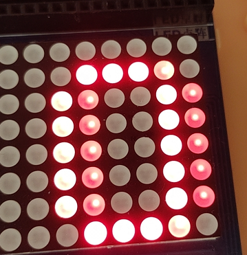

# 注意事项：一定要将J24短接片短接到GND端。
思路有了上两个chapter的铺垫，那么就很简单了，一个简单的for循环而已。。  
先设置P0，控制8x8点阵的第几列，再根据74HC595的控制led就可
```
void main()
{			
	u8 i;
	while(1)
	{
		P0=0x7f;//0111 1111
		for(i=0;i<8;i++)
		{
			P0=ledwei[i];		  //位选
			Hc595SendByte(ledduan[i]);	//发送段选数据
			delay(100);		   //延时
			Hc595SendByte(0x00);  //消隐
		}	
	}		
}

```
## 注意一定要记得消隐，否则在P0变化的过程中，会将之前74HC595的输入到另一列，出现以下现象
  
具体原因我猜测是因为位选之后74hc595进行了一次输出，让新一列被赋值了，这也是时钟不同步的问题吧
