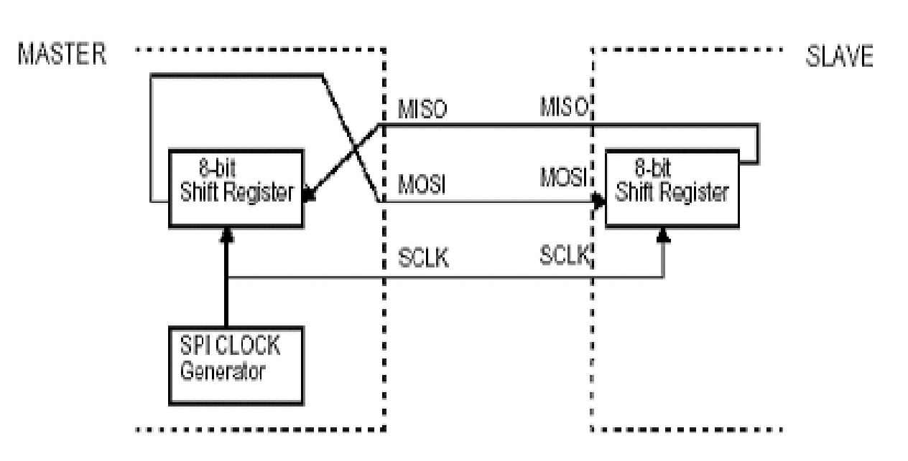
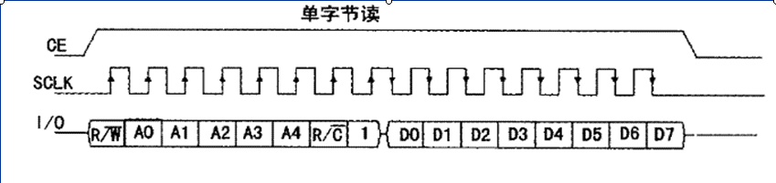
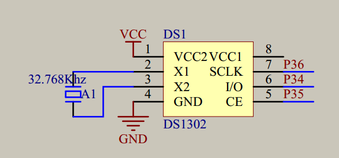

# 这是一个独立出来的时钟模块，跟自带的定时器不太一样
# DS1302时钟
## 一．DS1302的主要性能指标
（1）DS1302实时时钟具有能计算2100年之前的秒、分、时、日、日期、星期、月、年的能力，还有闰年调整的能力。

（2）内部含有31个字节静态RAM，可提供用户访问。

（3）采用串行数据传送方式，使得管脚数量最少，简单SPI 3线接口。

（4）工作电压范围宽：2.0～5.5V。

（5）工作电流：2.0V时，小于300nA。

 （6）时钟或RAM数据的读/写有两种传送方式：单字节传送和多字节传送方式。
 
 （7）采用8脚DIP封装或SOIC封装。
 
（8）与TTL兼容，Vcc=5V。

（9）可选工业级温度范围：-40C～+85C。

（10）具有涓流充电能力。

（11）采用主电源和备份电源双电源供应。

（12）备份电源可由电池或大容量电容实现。

### SPI总线概念
- SPI接口的全称是“Serial Peripheral Interface”,意为串行外围接口
- SPI接口主要应用在EEPROM,FLASH,实时时钟,AD转换器,还有数字信号处理器和数字信号解码器之间。
- SPI接口是在CPU和外围低速器件之间进行同步串行数据传输,在主器件的移位脉冲下,数据按位传输,高位在前,地位在后,为全双工通信,数据传输速度总体来说比I2C总线要快,速度可达到几Mbps。
- SPI接口是以主从方式工作的,这种模式通常有一个主器件和一个或多个从器件,其接口包括以下四种信号：
  - （1）MOSI – 主器件数据输出,从器件数据输入
  - （2）MISO – 主器件数据输入,从器件数据输出
  - （3）SCLK – 时钟信号,由主器件产生
  - （4）/CS   – 从器件使能信号,由主器件控制

  

### SPI接口内部硬件图示 
  
 最后,SPI接口的一个缺点：没有指定的流控制,没有应答机制确认是否接收到数据。 
## 二．引脚功能
### DS1302的引脚如图所示
  
其中：  
- X1、X2：32.768KHz晶振接入引脚。
- GND：地。
- ??：复位引脚，低电平有效,操作时高电平。
- I/O：数据输入/输出引脚，具有三态功能。
- SCLK：串行时钟输入引脚。
- Vcc1：工作电源引脚。
- Vcc2：备用电源引脚。 接入电池断电时提供1302电源
## 三．DS1302的寄存器及片内RAM
DS1302有一个控制寄存器、12个日历、时钟寄存器和31个RAM。可读写
### 1．控制寄存器
控制寄存器用于存放DS1302的控制命令字，DS1302的RST引脚回到高电平后写入的第一个字就为控制命令。它用于对DS1302读写过程进行控制，它的格式如下： 
```
  D7	D6	D5	D4	D3	D2	D1	D0
  1	RAM/CK	A4	A3	A2	A1	A0	RD/W
```
其中：  
- D7：固定为1
- D6：RAM/CK位，=1片内RAM，=0日历、时钟寄存器选择位。 
- D5~D1：地址位，用于选择进行读写的日历、时钟寄存器或片内RAM。对日历、时钟寄存器或片内RAM的选择见表。
- D0： 读写选择，=0写，=1读

```
寄存器名称	D7	D6	D5	D4	D3	D2	D1	D0
1	RAM/CK	A4	A3	A2	A1	A0	R/W
秒寄存器	1	0	0	0	0	0	0	0或1
分寄存器	1	0	0	0	0	0	1	0或1
小时寄存器	1	0	0	0	0	1	0	0或1
日寄存器	1	0	0	0	0	1	1	0或1
月寄存器	1	0	0	0	1	0	0	0或1
星期寄存器	1	0	0	0	1	0	1	0或1
年寄存器	1	0	0	0	1	1	0	0或1
```
```
寄存器名称	D7	D6	D5	D4	D3	D2	D1	D0
1	RAM/CK	A4	A3	A2	A1	A0	R/W
写保护寄存器	1	0	0	0	1	1	1	0或1
慢充电寄存器	1	0	0	1	0	0	0	0或1
时钟突发模式	1	0	1	1	1	1	1	0或1
RAM0	1	1	0	0	0	0	0	0或1
	1	1						0或1
RAM30	1	1	1	1	1	1	0	0或1
RAM突发模式	1	1	1	1	1	1	1	0或1
```
### 2．日历、时钟寄存器
DS1302共有12个寄存器，其中有7个与日历、时钟相关，存放的数据为BCD码形式。日历、时钟寄存器的格式如表。
```
寄存器名称	取值范围	D7	D6	D5	D4	D3	D2	D1	D0
秒寄存器	00~59	CH	秒的十位	秒的个位
分寄存器	00~59	0	分的十位	分的个位
小时寄存器	01~12或00~23	12/24	0	A/P	HR	小时的个位
日寄存器	01~31	0	0	日的十位	日的个位
```
```
寄存器名称	取值
范围	D7	D6	D5	D4	D3	D2	D1	D0
月寄存器	01~12	0	0	0	1或0	月的个位
星期寄存器	01~07	0	0	0	0	星期几
年寄存器	01~99	年的十位	年的个位
写保护寄存器		WP	0	0	0	0	0	0	0
慢充电寄存器		TCS	TCS	TCS	TCS	DS	DS	RS	RS
时钟突发寄存器									
```
说明：  
（1）数据都以BCD码形式。

（2）小时寄存器的D7位为12小时制/24小时制的选择位，当为1时选12小时制，当为0时选24小时制。当12小时制时，D5位为1是上午，D5位为0是下午，D4为小时的十位。当24小时制时，D5、D4位为小时的十位。

（3）秒寄存器中的CH位为时钟暂停位，当为1时钟暂停，为0时钟开始启动。

 (4）写保护寄存器中的WP为写保护位，当WP=1，写保护，当WP=0未写保护，当对日历、时钟寄存器或片内RAM进行写时WP应清零，当对日历、时钟寄存器或片内RAM进行读时WP一般置1。

（5）慢充电寄存器的TCS位为控制慢充电的选择，当它为1010才能使慢充电工作。DS为二极管选择位。DS为01选择一个二极管，DS为10选择二个二极管，DS为11或00充电器被禁止，与TCS无关。RS用于选择连接在VCC2与VCC1之间的电阻，RS为00，充电器被禁止，与TCS无关，电阻选择情况见表.
```
RS位	电阻器	阻值
00	无	无
01	R1	2K
10	R2	4K
11	R3	8K
```
## 补充什么是BCD码
BCD码是通过4位二进制码来表示1位十进制中的0~9这10个数码。  
> 二进制码转换为BCD码的方式为：4位二进制码大于1001时，加6。
如:  
BCD码00001100的二进制码为：00001100+6=00010010
```
0	0000	5	0101
1	0001	6	0110
2	0010	7	0111
3	0011	8	1000
4	0100	9	1001
```
## 3.片内RAM
DS1302片内有31个RAM单元，对片内RAM的操作有两种方式：
- 单字节方式
- 多字节方式。

当控制命令字为C0H~FDH时为单字节读写方式，命令字中的D5~D1用于选择对应的RAM单元，其中奇数为读操作，偶数为写操作。  
当控制命令字为FEH、FFH时为多字节操作（表中的RAM突发模式），多字节操作可一次把所有的RAM单元内容进行读写。FEH为写操作，FFH为读操作。
## 数据输入输出(I/O)
在控制指令字输入后的下一个SCLK时钟的上升沿时，数据被写入DS1302，数据输入从低位即位0开始。  
同样，在紧跟8位的控制指令字后的下一个SCLK脉冲的下降沿读出DS1302的数据，读出数据时从低位0位到高位7。
### 单字节读写
  
DS1302是通过SPI串行总线跟单片机通信的，当进行一次读写操作时最少得读写两个字节，第一个字节是控制字节，就是一个命令，告诉DS1302是读还是写操作，是对RAM还是对CLOK寄存器操作。第二个字节就是要读或写的数据了。

单字节读写：只有在SCLK为低电平时，才能将CE置为高电平。所以在进行操作之前先将SCLK置低电平，然后将CE置为高电平，接着开始在IO上面放入要传送的电平信号，然后跳变SCLK。数据在SCLK上升沿时，DS1302读写数据，在SCLK下降沿时，DS1302放置数据到IO上
  
  


