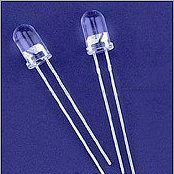
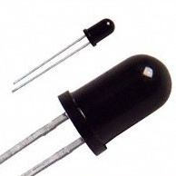
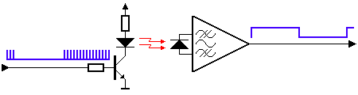
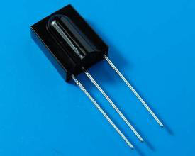
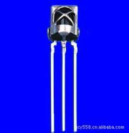
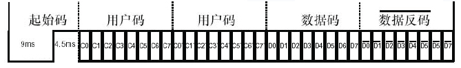
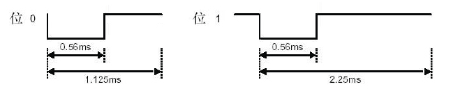
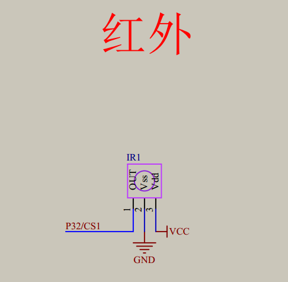

# 红外通信
## 忠告
__不要试图去深究，因为没必要去详细这么底层的东西，如果非要去了解就等以后学到深处再说，现在学一点意义都没有，我们会用，封装起来就行！！__
最底层有[代码解析](#代码解析)
## 一. 什么是红外线
> 人的眼睛能看到的可见光按波长从长到短排列，依次为红、橙、黄、绿、青、蓝、紫。其中红光的波长范围为0.62～0.76μm；紫光的波长范围为0.38～0.46μm。比紫光波长还短的光叫紫外线，比红光波长还长的光叫红外线.红外线遥控就是利用波长为0.76～1.5μm之间的近红外线来传送控制信号的。

## 二. 红外线系统的组成
红外线遥控器已被广泛使用在各种类型的家电产品上，它的出现给使用电器提供了很多的便利。红外线系统一般由红外发射装置和红外接收设备两大部分组成。  
红外发射装置又可由键盘电路、红外编码芯片、电源和红外发射电路组成。红外接收设备可由红外接收电路、红外解码芯片、电源和应用电路组成。  
通常为了使信号更好的被发射端发送出去，经常会将二进制数据信号调制成为脉冲信号，通过红外发射管发射。常用的有通过脉冲宽度来实现信号调制的脉宽调制(PWM)和通过脉冲串之间的时间间隔来实现信号调制的脉时调制(PPM)两种方法。
## 三. 红外发射管
红外遥控发射装置，也就是通常我们说的红外遥控器是由键盘电路、红外编码电路、电源电路和红外发射电路组成。红外发射电路的主要元件为红外发光二极管。它实际上是一只特殊的发光二极管；由于其内部材料不同于普通发光二极管，因而在其两端施加一定电压时，它便发出的是红外线而不是可见光。目前大量的使用的红外发光二极管发出的红外线波长为940nm左右，外形与普通φ5发光二极管相同。


## 四. 红外遥控器发射
通常红外遥控为了提高抗干扰性能和降低电源消耗，红外遥控器常用载波的方式传送二进制编码，常用的载波频率为38kHz，这是由发射端所使用的455kHz晶振来决定的。在发射端要对晶振进行整数分频，分频系数一般取12，所以455kHz÷12≈37.9kHz≈38kHz。

也有一些遥控系统采用36kHz、40 kHz、56 kHz等，一般由发射端晶振的振荡频率来决定。所以，通常的红外遥控器是将遥控信号（二进制脉冲码）调制在38KHz的载波上，经缓冲放大后送至红外发光二极管，转化为红外信号发射出去的。

二进制脉冲码的形式有多种，其中最为常用的是PWM码（脉冲宽度调制码）和PPM码（脉冲位置调制码，脉冲串之间的时间间隔来实现信号调制）。如果要开发红外接收设备，一定要知道红外遥控器的编码方式和载波频率，我们才可以选取一体化红外接收头和制定解码方案。  
发射端接收端
### 遥控器

## 五. 红外线接收
红外接收设备是由红外接收电路、红外解码、电源和应用电路组成。红外遥控接收器的主要作用是将遥控发射器发来的红外光信好转换成电信号，再放大、限幅、检波、整形，形成遥控指令脉冲，输出至遥控微处理器。  
近几年不论是业余制作还是正式产品，大多都采用成品红外接收头。成品红外接收头的封装大致有两种：一种采用铁皮屏蔽；一种是塑料封装。均有三只引脚，即电源正（VDD）、电源负（GND）和数据输出（VOUT）。在使用时注意成品红外接收头的载波频率,另外在遥控编码芯片输出的波形与接收头端收到的波形。  

## 六.数据格式
数据格式包括了引导码、用户码、数据码和数据码反码，编码总占32位。数据反码是数据码反相后的编码，编码时可用于对数据的纠错。注意：第二段的用户码也可以在遥控应用电路中被设置成第一段用户码的反码。

## 七.位定义
用户码或数据码中的每一个位可以是位 ‘1’ ，也可以是位 ‘0’。区分 ‘0’和 ‘1’是利用脉冲的时间间隔来区分，这种编码方式称为脉冲位置调制方式，英文简写PPM  

# 原理图


## 代码解析
红外信号的编码包括了这四个部分，即:
- 引导码
- 用户码
- 数据码
- 数据码反码

具体信息在[红外数据格式](#六.数据格式)这里  
我们的代码也就是基于这个来建立的。
### 预备initiation
在做这个之前，我们首先得知道，红外信号都是用中断来处理相关的工作的，即我们要打开中断，[详细可看](https://github.com/yujiecong/yjc-BST-M51-learning/tree/master/contents/project9%20%E5%8D%95%E7%89%87%E6%9C%BA%E4%B8%AD%E6%96%AD%E7%B3%BB%E7%BB%9F)  
我们先做这些:
- 中断请求：中断事件一旦发生，中断源就提交中断请求（将中断 标志位置1），欲请求CPU暂时放下目前的工作转向为该中断作专项 服务。
- 中断使能：虽然中断源提交了中断请求，但是，能否得到CPU的 响应，还要取决于该中断请求能否通过若干关卡送达CPU（中断使能 位等于1，关卡放行），这些关卡有以下两类： 此中断源的中断允许位； 全局中断允许位。
- 中断响应：如果一路放行，则CPU响应该中断请求，记录断点， 跳转到中断服务程序。对于INT和TMR中断，中断响应时中断标志位 会被硬件自动清零。
- 中断处理：对中断源进行有针对性的服务。
- 中断返回：返回到主程序断点处，继续执行主程序。

我们先把请求以及使能端打开。
```
void IrInit()
{
	IT0=1;//下降沿触发
	EX0=1;//打开中断0允许
	EA=1;	//打开总中断

	IRIN=1;//初始化端口
}
```
接着要做的就是理解如何做到c语言对红外编码..  
其实是根据这个最重要的[位定义](#七.位定义)做到的，他是以PPM的方式控制，那么我们只要
__精确控制__
我们的发送时间，就可以做到了.
### 精确控制
注意到起始码由9ms的低电平和4.5ms高电平组成，那么我们直接构建一个准确的信号过去，在之后的下降沿，就是开始读取数据的时候  
红外的引脚IRIN在正常情况是高电平的，我们只要检测他是维持了9ms的低电平，超时要记得跳出，因为肯定是有问题。然后再给一个4ms的高电平检测即可
```
if(IRIN==0)		//确认是否真的接收到正确的信号
	{	 
		
		err=1000;				//1000*10us=10ms,超过说明接收到错误的信号
		/*当两个条件都为真是循环，如果有一个条件为假的时候跳出循环，免得程序出错的时
		侯，程序死在这里*/	
		while((IRIN==0)&&(err>0))	//等待前面9ms的低电平过去  		
		{			
			delay(1);
			err--;
		} 
		if(IRIN==1)			//如果正确等到9ms低电平
		{
			err=500;
			while((IRIN==1)&&(err>0))		 //等待4.5ms的起始高电平过去
			{
				delay(1);
				err--;
			}
        
        ...
        省略
    }
```
剩下的根据[位定义](#七.位定义)提到的，我们只要根据0.56ms高电平和1.125ms低电平组成0这个原则来传入数据即可
```
for(k=0;k<4;k++)		//共有4组数据
			{				
				for(j=0;j<8;j++)	//接收一组数据
				{

					err=60;		
					while((IRIN==0)&&(err>0))//等待信号前面的560us低电平过去
					{
						delay(1);
						err--;
					}
					err=500;
					while((IRIN==1)&&(err>0))	 //计算高电平的时间长度。
					{
						delay(10);	 //0.1ms
						Time++;
						err--;
						if(Time>30)
						{
							return;
						}
					}
					IrValue[k]>>=1;	 //k表示第几组数据
					if(Time>=8)			//如果高电平出现大于565us，那么是1
					{
						IrValue[k]|=0x80;
					}
					Time=0;		//用完时间要重新赋值							
				}
			}
```