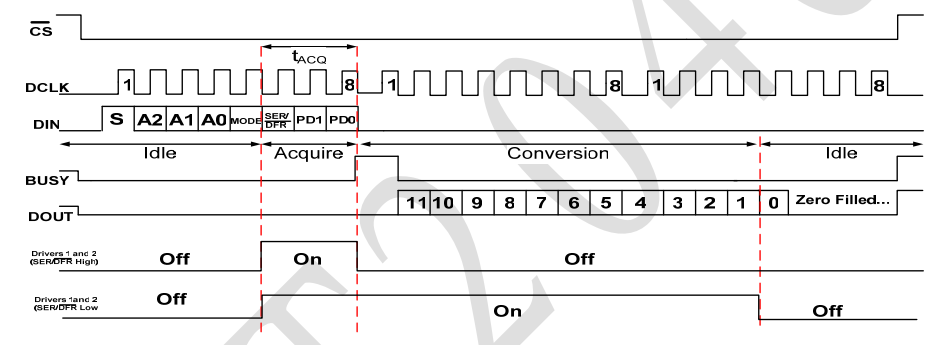
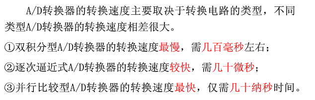
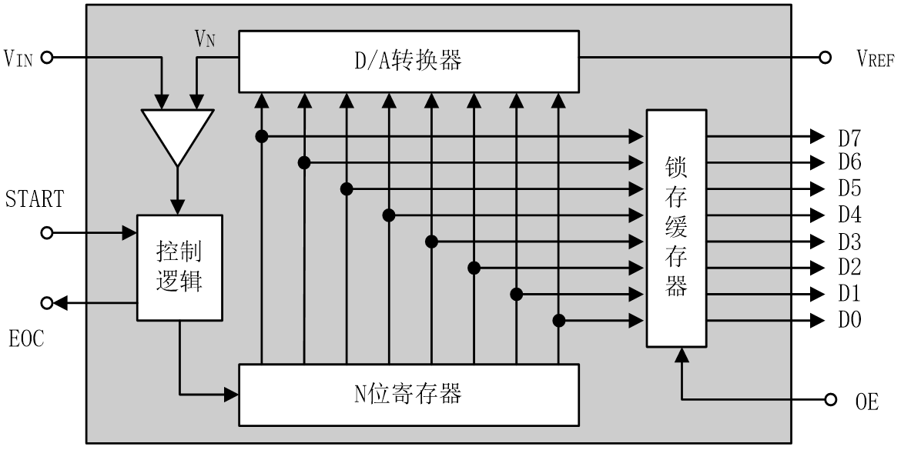
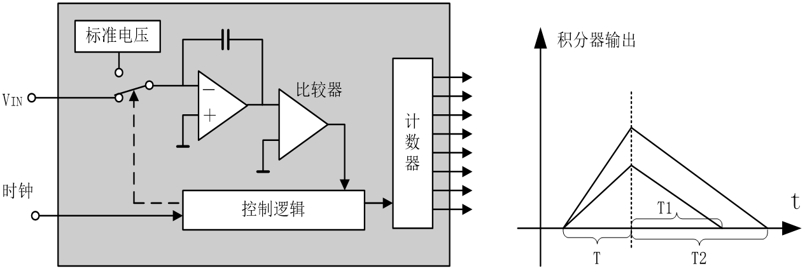
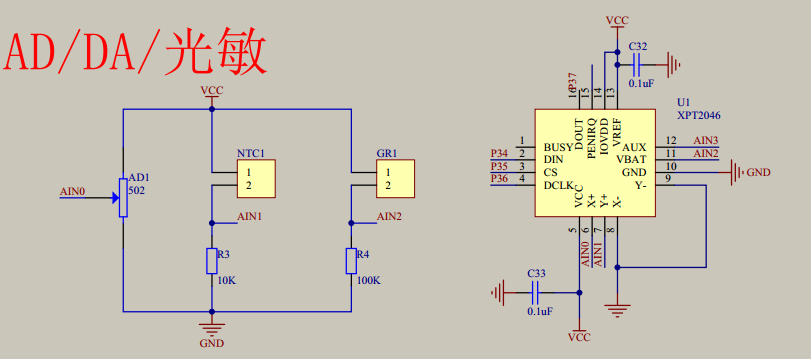
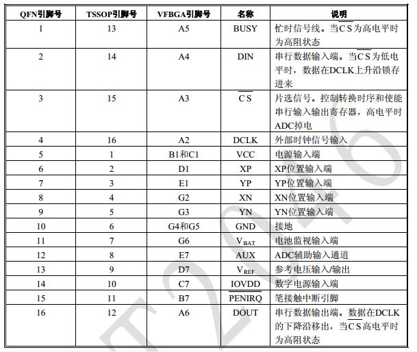
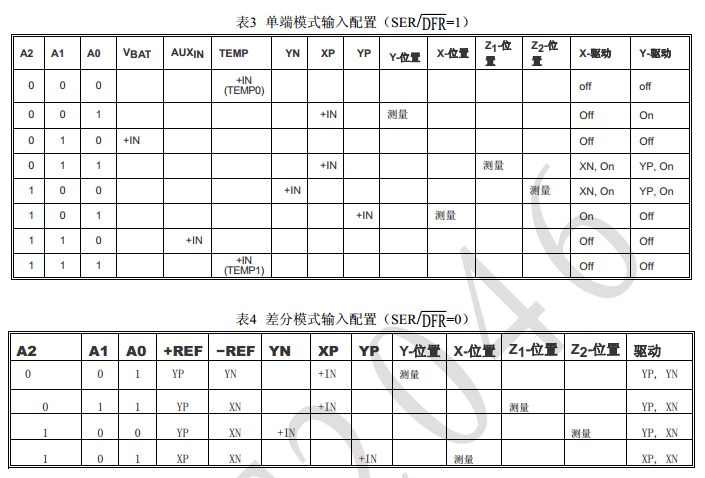
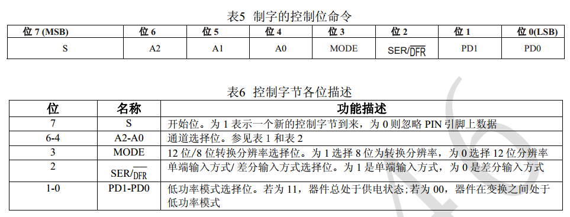
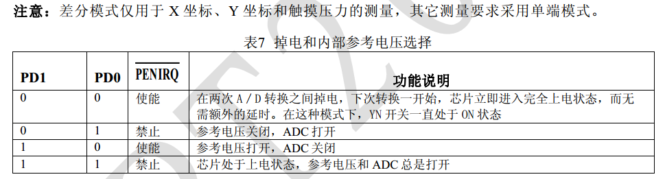

# AD模数转换
## 代码解析
此处应有[芯片手册](xpt2046中文.pdf)  
说来说去，最重要的是这张图  
### xpt2046工作原理图
  
只有这张图才能写出对应的逻辑，因为这个芯片就是按这种方式工作的  
来介绍一下管脚
```
//---定义使用的IO口---//
sbit DOUT = P3^7;	  //输出
sbit CLK  = P3^6;	  //时钟
sbit DIN  = P3^4;	  //输入
sbit CS   = P3^5;	  //片选
```
在[上图](#xpt2046工作原理图)的DIN行中，可以看到，输入了8个位，也就是一个byte的量，那么我们要这样写.  
但是记得要把CLK和CS先置0，再传输
```
uint Read_AD_Data(uchar cmd)
{
	uchar i;
	uint AD_Value;
	CLK = 0;
	CS  = 0;
	SPI_Write(cmd);
    ...
}
```
由于芯片是从最高位读起来的，所以要把最高位>>7位再发送,并且是用CLK的上升沿发送数据
```
void SPI_Write(uchar dat)
{
	uchar i;
	CLK = 0;
	for(i=0; i<8; i++)
	{
		DIN = dat >> 7;  	//放置最高位
		dat <<= 1;
		CLK = 0;			//上升沿放置数据

		CLK = 1;

	}
}
```
接着，发送完数据后，看到BUSY有个小突起对吧，其实是在读取输入,处理中
```
uint Read_AD_Data(uchar cmd)
{
	uchar i;
	uint AD_Value;
	CLK = 0;
	CS  = 0;
	SPI_Write(cmd);
	for(i=6; i>0; i--); 	//延时等待转换结果
	CLK = 1;	  //发送一个时钟周期，清除BUSY
	_nop_();
	_nop_();
	CLK = 0;
	_nop_();
	_nop_();
	AD_Value=SPI_Read();
	CS = 1;
	return AD_Value;	
}
```
最后我们读取这个DOUT来得到输出，也就是检测的AD值即可
```
uint SPI_Read(void)
{
	uint i, dat=0;
	CLK = 0;
	for(i=0; i<12; i++)		//接收12位数据
	{
		dat <<= 1;

		CLK = 1;
		CLK = 0;

		dat |= DOUT;

	}
	return dat;	
}
```
由于是12位数据，所以最大读到4096-1，所以最终的范围只有0~4095。。  
注意，只要更换一下发送的数据就可以获取到不同的器件了
```
如果要检测转换电位器模拟信号，控制字命令寄存器值为0X94或者0XB4.
如果要检测转换热敏电阻模拟信号，控制字命令寄存器值为0XD4.
如果要检测转换光敏电阻模拟信号，控制字命令寄存器值为0XA4.
如果要检测转换AIN3通道上模拟信号，控制字命令寄存器值为0XE4.
```
## 一、A/D转换器的主要技术指标
### 1、分辨率
ADC的分辨率是指使输出数字量变化一个相邻数码所需输入模拟电压的变化量。

常用二进制的位数表示。例如12位ADC的分辨率就是12位，或者说分辨率为满刻度的1/(2^12)。

一个10V满刻度的12位ADC能分辨输入电压变化最小值是10V×1/(2^12 )=2.4mV。
### 2、量化误差
ADC把模拟量变为数字量，用数字量近似表示模拟量，这个过程称为**量化**。  

量化误差是ADC的有限位数对模拟量进行量化而引起的误差。

实际上，要准确表示模拟量，ADC的位数需很大甚至无穷大。一个分辨率有限的ADC的阶梯状转换特性曲线与具有无限分辨率的ADC转换特性曲线（直线）之间的最大偏差即是量化误差。 

### 3、偏移误差
偏移误差是指输入信号为零时，输出信号不为零的值，所以有时又称为零值误差。假定ADC没有非线性误差，则其转换特性曲线各阶梯中点的连线必定是直线，这条直线与横轴相交点所对应的输入电压值就是偏移误差。

### ４、满刻度误差
满刻度误差又称为增益误差。ADC的满刻度误差是指满刻度输出数码所对应的实际输入电压与理想输入电压之差。
### 5、线性度
线性度有时又称为非线性度，它是指转换器实际的转换特性与理想直线的最大偏差。
### 6、绝对精度
在一个转换器中，任何数码所对应的实际模拟量输入与理论模拟输入之差的最大值，称为绝对精度。对于ADC而言，可以在每一个阶梯的水平中点进行测量，它包括了所有的误差。
### 7、转换速率
ADC的转换速率是能够重复进行数据转换的速度，即每秒转换的次数。而完成一次A/D转换所需的时间（包括稳定时间），则是转换速率的倒数。

## 逐次逼近式ADC的转换原理
  
逐次逼近式AD转换器与计数式A/D转换类似，只是数字量由“逐次逼近寄存器SAR”产生。SAR使用“对分搜索法”产生数字量，以8位数字量为例:

SAR首先产生8位数字量的一半，即10000000B,试探模拟量Vi的大小，若Vn>Vi，清除最高位，若Vn<Vi,保留最高位。在最高位确定后，SAR又以对分搜索法确定次高位，即以低7位的一半y1000000B(y为已确定位) 试探模拟量Vi的大小。  
在bit6确定后，SAR以对分搜索法确定bit5位，即以低6位的一半yy100000B(y为已确定位) 试探模拟量的大小。重复这一过程，直到最低位bit0被确定，转换结束
## 双积分式ADC的转换原理
  
## AD转换原理图
  
## AD芯片引脚图
  
  
  
  

- 如果要检测转换电位器模拟信号，控制字命令寄存器值为0X94或者0XB4.
- 如果要检测转换热敏电阻模拟信号，控制字命令寄存器值为0XD4.
- 如果要检测转换光敏电阻模拟信号，控制字命令寄存器值为0XA4.
- 如果要检测转换AIN3通道上模拟信号，控制字命令寄存器值为0XE4.

