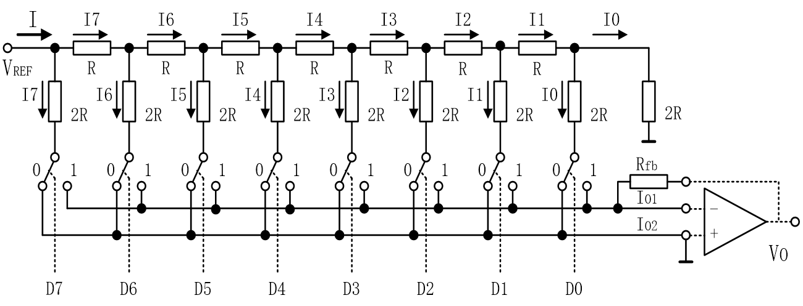
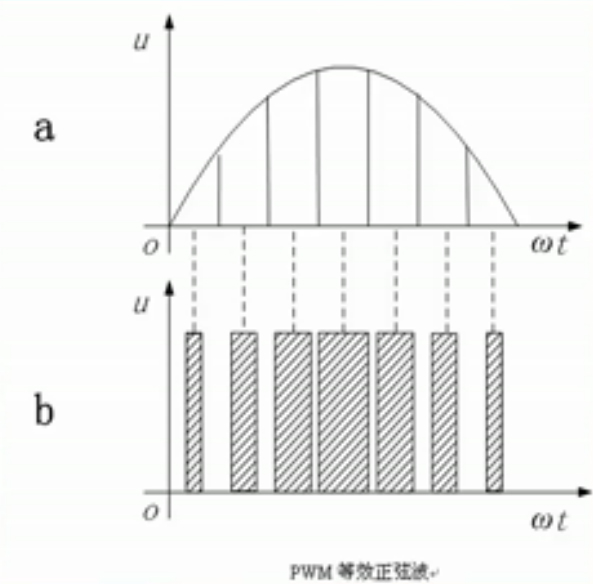
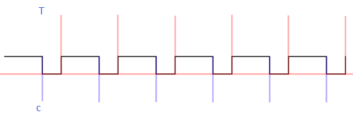
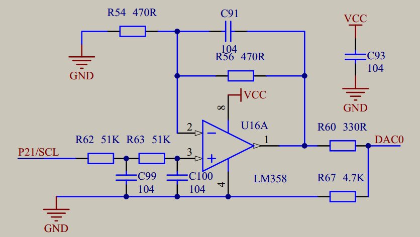
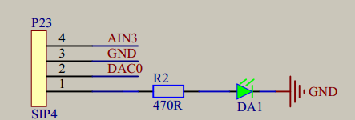

# DA数模转换（PWM输出）
## 代码分析
[其实就是之前的PWM调光，也就是呼吸灯啦](https://github.com/yujiecong/yjc-BST-M51-learning/blob/master/contents/project4%20%E6%B5%81%E6%B0%B4%E7%81%AF%E5%AE%9E%E9%AA%8C/%E5%91%BC%E5%90%B8%E7%81%AF.c)

通过控制亮灯和关灯的变化时间差来欺骗人眼，误以为LED在呼吸，其实是一个亮的多一点，灭的快一点，亮的少一点，灭的快一点的过程啦

## 1.DAC转换原理和技术指标
### D/A转换器的原理及主要技术指标
#### 一、D/A转换器的基本原理及分类
Ｔ型电阻网络D/A转换器 ：
  
由图可知，运放两个输入端为“虚地”，所以电位都约为0。所以无论开关在0或者1，最后两个2R都是并联得R，和电阻R串联又为2R,以此类推，那么到最前端，相当于两个2R的电阻并联，可知电流I=Vref/R。I7=I/2,I6=1/2*I/2,由此追溯到I0=I/256,如果Rfb=R，那么V0只与Vref有关，即V0=Vref*z/256。
#### 二、D/A转换器的主要性能指标
1、分辨率  
分辨率是指输入数字量的最低有效位（LSB）发生变化时，所对应的输出模拟量（电压或电流）的变化量。它反映了输出模拟量的最小变化值。

分辨率与输入数字量的位数有确定的关系，可以表示成FS /（2^n）。FS表示满量程输入值，n为二进制位数。对于5V的满量程，采用８位的DAC时，分辨率为5V/256＝19.5mV；当采用12位的DAC时，分辨率则为5V/4096＝1.22mV。显然，位数越多分辨率就越高。  

2、线性度  
线性度（也称非线性误差）是实际转换特性曲线与理想直线特性之间的最大偏差。常以相对于满量程的百分数表示。如±１％是指实际输出值与理论值之差在满刻度的±１％以内。  

3、绝对精度和相对精度  
绝对精度（简称精度）是指在整个刻度范围内，任一输入数码所对应的模拟量实际输出值与理论值之间的最大误差。绝对精度是由DAC的增益误差（当输入数码为全1时，实际输出值与理想输出值之差）、零点误差（数码输入为全０时，DAC的非零输出值）、非线性误差和噪声等引起的。绝对精度（即最大误差）应小于1个LSB。

**相对精度与绝对精度表示同一含义，用最大误差相对于满刻度的百分比表示。**

4、建立时间  
建立时间是指输入的数字量发生满刻度变化时，输出模拟信号达到满刻度值的±1/2LSB所需的时间。是描述D/A转换速率的一个动态指标。

电流输出型DAC的建立时间短。电压输出型DAC的建立时间主要决定于运算放大器的响应时间。根据建立时间的长短，可以将DAC分成超高速（＜1μS)、高速（10～1μS）、中速（100～10μS）、低速（≥100μS）几档。

**应当注意，精度和分辨率具有一定的联系，但概念不同。DAC的位数多时，分辨率会提高，对应于影响精度的量化误差会减小。但其它误差（如温度漂移、线性不良等）的影响仍会使DAC的精度变差。**

## 2.PWM工作原理
### PWM简介
PWM 是 Pulse Width Modulation 的缩写，中文意思就是脉冲宽度调制，简称脉宽调制。它是利用微处理器的数字输出来对模拟电路进行控制的一种非常有效的技术  
其控制简单、灵活和动态响应好等优点而成为电力电子技术最广泛应用的控制方式，其应用领域包括测量，通信，功率控制与变换，电动机控制、伺服控制、调光、开关电源，甚至某些音频放大器，因此研究基于 PWM 技术的正负脉宽数控调制信号发生器具有十分重要的现实意义。
### PWM等效图形
  

PWM 是一种对模拟信号电平进行数字编码的方法。通过高分辨率计数器的使用，方波的占空比被调制用来对一个具体模拟信号的电平进行编码。

PWM 信号仍然是数字的，因为在给定的任何时刻，满幅值的直流供电要么完全有(ON)，要么完全无(OFF)。电压或电流源是以一种通(ON)或断(OFF)的重复脉冲序列被加到模拟负载上去的。

通的时候即是直流供电被加到负载上的时候，断的时候即是供电被断开的时候。只要带宽足够，任何模拟值都可以使用 PWM 进行编码。

### PWM  工作原理
  
### PWM原理图
  
  