# LCD1602液晶
## 前言

板子好像有些问题..  
建议多看看[LCD1602液晶完整中文资料](LCD1602液晶完整中文资料.pdf)，里面有更加详细的解释，可以拿到更多的功能,在[这里](#额外)我也会说一些
## 1.LCD1602液晶工作原理
  
### LCD1602简介
1602液晶也叫1602字符型液晶，它是一种专门用来显示字母、数字、符号的点阵型液晶模块。  
它是由若干个5x7或者5x10的点阵字符位组成，每个点阵字符位都可以用显示一个字符，每位之间有一个点距的间隔，每行之间也有间隔，起到了字符间距和行间距的作用，正因为如此，所以它不能很好的显示图片。
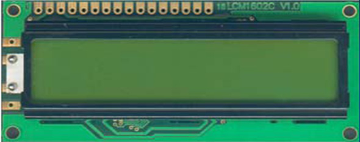

### 1602的引脚
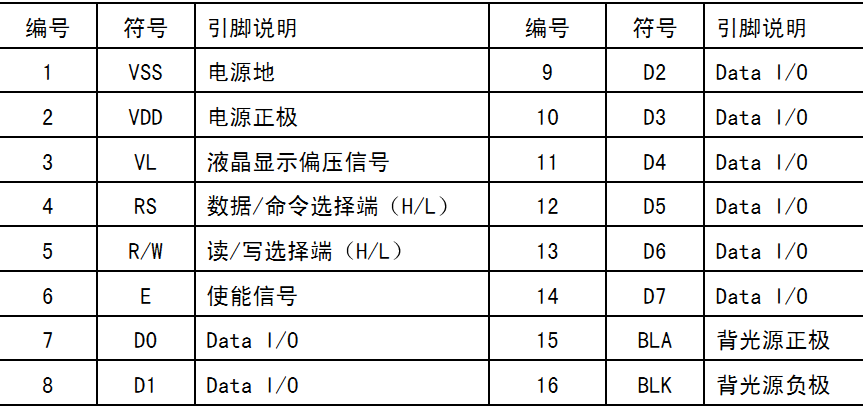  


## 操作步骤:
1. 初始化
2. 写命令（RS=L）设置显示坐标
3. 写数据（RS=H）

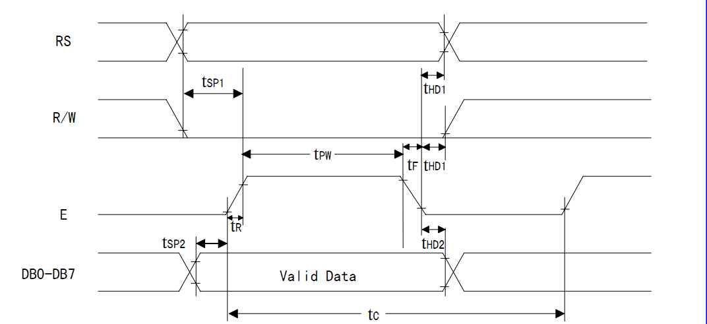  

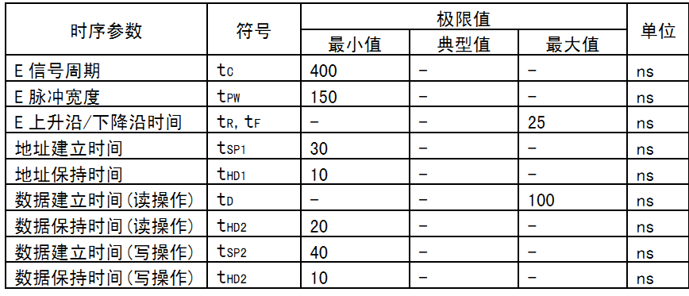  

## 一：LCD1602关键性的指令设置

### 1.清屏指令

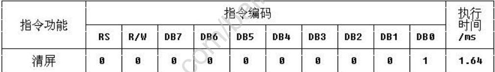  

功能：
- <1> 清除液晶显示器，即将 DDRAM 的内容全部填入"空白"的 ASCII码 20H; 
- <2> 光标归位，即将光标撤回液晶显示屏的左上方; 
- <3> 将地址计数器(AC)的值设为 0。

### 2.进入模式设置指令

功能 ：   
设定每次定入 1 位数据后光标的移位方向 ,并且设定每次写入的一个字符是否移动。  
参数设定的情况如下所示：  
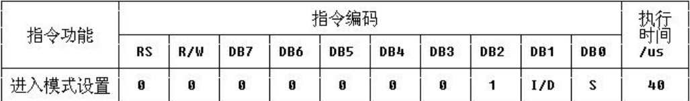  
```
位名  设置
I/D  0=写入新数据后光标左移     1=写入新数据后光标右移
S    0=写入新数据后显示屏不移动 1=写入新数据后显示屏整体右移 1 个字符
```


### 3.显示开关控制指令


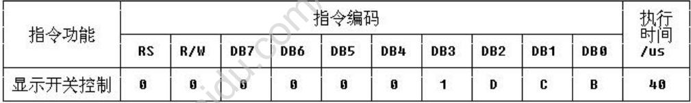  

功能：控制显示器开/关、光标显示/关闭以及光标是否闪烁。  
参数设定的情况如下：
```
位名   设置
D     0=显示功能关     1=显示功能开
C     0=无光标        1=有光标
B     0=光标闪烁     1=光标不闪烁
```

 ### 4.功能设定指令
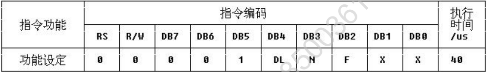   
功能：
- 设定数据总线位数、显示的行数及字型。

参数设定的情况如下：
```
位名   设置
DL    0=数据总线为 4 位    1=数据总线为 8 位
N     0=显示 1 行          1=显示 2 行
F     0=5×7 点阵/每字符     1=5×10 点阵/每字符
```

## 二：在设置完成之后我们就要明白具体是在哪显示，在哪个位置显示？

在对液晶模块的初始化中要先设置其显示模式， 在液晶模块显示字符时光标是自动右移的， 无需人工干预。 每次输入指令前都要判断液晶模块是否处于忙的状态。  
DDRAM 就是显示数据 RAM ，用来寄存待显示的字符代码。  
共 80 个字节，其地址和屏幕的对应关系如下表：
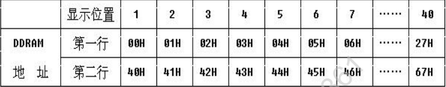  
要显示字符时要先输入显示字符地址，也就是告诉模块在哪里显示字符，例如第二行第一个字符的地址是 40H， 那么是否直接写入 40H 就可以将光标定位  
__在第二行第一个字符的位置呢？这样不行，因为写入显示地址时要求最高位D7恒定为高电平 1 所以实际写入的数据应该是__  
01000000B（40H）+10000000B(80H)=11000000B(C0H)。  
在 1602 中我们就用前 16 个就行了。第二行也一样用前 16 个地址。对应如下：
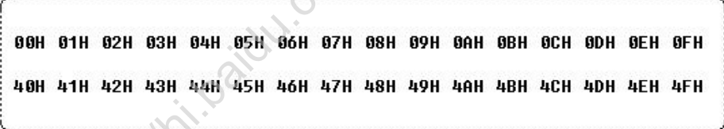  


## RAM地址映射图
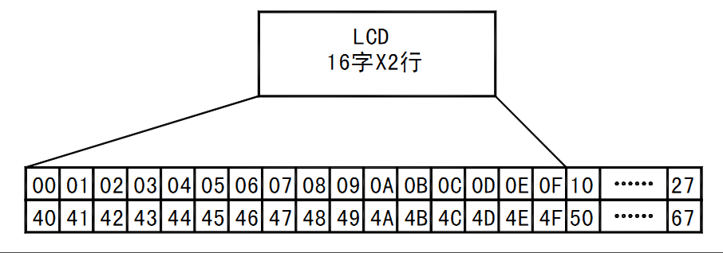  

## 原理图
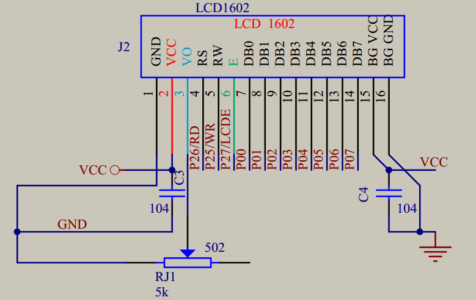  

## 额外

仅仅会这些还不够，因为，我需要更强大的功能，例如自定义字符
刚才我说了想要在 LCD1602 屏幕的第一行第一列显示一个"A"字,就要向DDRAM 的 00H 地址写入“A”字的代码 41H 就行了  
可 41H 这一个字节的代码如何才能让 LCD 模块在屏幕的阵点上显示“A”字呢？  

同样，在 LCD 模块上也固化了字模存储器，这就是 CGROM 和 CGRAM。  

HD44780 内置了 192 个常用字符的字模， 存于字符产生器 CGROM(Character Generator ROM)中，另外还有 8 个允许用户

**自定义的字符产生 RAM，称为 CGRAM(Character Generator RAM)。**

下图说明了CGROM 和 CGRAM 与字符的对应关系。  
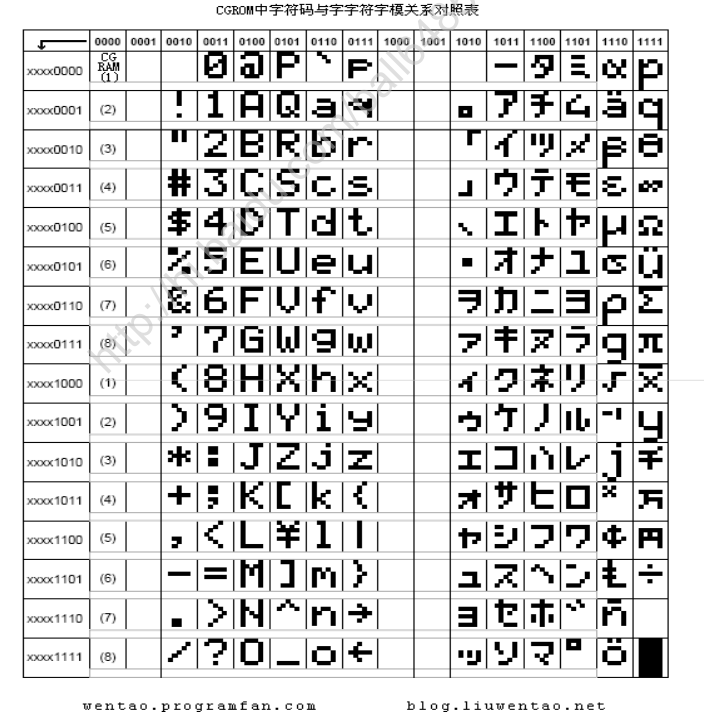  
从上图可以看出，“A”字的对应上面高位代码为 0100，对应左边低位代码为 0001，合起来就是 01000001，也就是 41H。可见它的代码与我们 PC 中的字符  

代码是基本一致的。因此我们在向 DDRAM 写 C51 字符代码程序时甚至可以直接用P1＝'A'这样的方法。

PC 在编译时就把“A”先转为 41H 代码了。


字符代码 0x00～0x0F 为用户自定义的字符图形 RAM(对于 5X8 点阵的字符，可以存放 8 组，5X10 点阵的字符，存放 4 组)，就是 CGRAM 了。

后面我会详细说的。  
0x20～0x7F 为标准的 ASCII 码，0xA0～0xFF 为日文字符和希腊文字符，其余字符码(0x10～0x1F 及 0x80～0x9F)没有定义。

那么如何对 DDRAM 的内容和地址进行具体操作呢，下面先说说 HD44780 的指令集及其设置说明，请浏览该指令集，并找出对 DDRAM 的内容和地址进行操作的指令。  

## 显示自定义字符
上面只是显示了‘A’这一个字符（即将 CGROM 中的‘A’写入 DDRAM）;  
下面我再补充一下：（显示一个自定义字符）  
步骤如下：  
1. 先将自定义字符写入 CGRAM 
2. 再将 CGRAM 中的自定义字符送到 DDRAM 中显示

很简单的：看好了 查看 LCD1602 的 CGROM 字符代码表，可以发现 从 00000000B~00000111B（00H~07H）地址的内容是没有定义的，它是留给用户自己定义的，用户可以通过先定义 LCD1602 的 CGRAM 中的内容，然后就可以同调用 CGROM 字符一样来调用自定义好的字符（这里提示一下，自定义的字符最多可写 8 个）  

那么如何设定CGRAM中的内容呢？首先我们要把所要编写的字符对应于5X8点阵的“字模”提取出来，我们可以通过相关的软件来提取，也可以手工提取。说白 了也就是将点阵的某一行中有显示的点用 1 表示，无显示的点用 0 表示，以此形 成该行对应的字模数据。  

设定 CGRAM 的内容，要一行一行的设定，每一行对应一个 CGRAM，5X8 点阵，每行 5 点，共 8 行，因此要将 8 行的字模数据都写入 CGRAM。写好后,就可像调用 CGROM 字符一样来来调用它了。