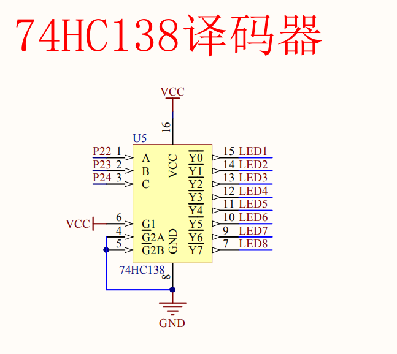

# 如何选择第几位数码管?这里用的是P2^234这三个口来操控
也就是这个译码器
  
3-8译码器，我只能说懂得都懂  
分别定义他们为
```
sbit LSA=P2^2;
sbit LSB=P2^3;
sbit LSC=P2^4;
```
那么当LSA,LSB,LSC=0,0,0时:    
此时代表第一位数码管，再置P0位选即可显示数字。值得注意的是是动态的显示，而不是静态的。  
以此类推
```
void DigDisplay()
{
	u8 i;
	for(i=0;i<8;i++)
	{
		switch(i)	 //位选，选择点亮的数码管，
		{
		   case(0):
				LSA=1;LSB=1;LSC=1; break;//显示第0位
			case(1):
				LSA=0;LSB=1;LSC=1; break;//显示第1位
			case(2):
				LSA=1;LSB=0;LSC=1; break;//显示第2位
			case(3):	
				LSA=0;LSB=0;LSC=1; break;//显示第3位
			case(4):
				LSA=1;LSB=1;LSC=0; break;//显示第4位
			case(5):
				LSA=0;LSB=1;LSC=0; break;//显示第5位
			case(6):
				LSA=1;LSB=0;LSC=0; break;//显示第6位
			case(7):
				LSA=0;LSB=0;LSC=0; break;//显示第7位	
		}
		P0=smgduan[i];//发送段码
		delay(100); //间隔一段时间扫描	
		P0=0x00;//消隐
	}
}
```
> 动态显示的特点是将所有数码管的段选线并联在一起，由位选线控制是哪一位数码管有效。选亮数码管采用动态扫描显示。所谓动态扫描显示即轮流向各位数码管送出字形码和相应的位选，利用发光管的余辉和人眼视觉暂留作用，使人的感觉好像各位数码管同时都在显示。动态显示的亮度比静态显示要差一些，所以在选择限流电阻时应略小于静态显示电路中的。
