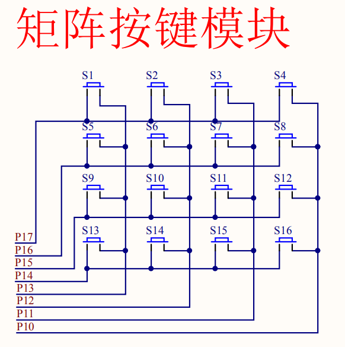

# 新增的一个模块！
一个4x4的按键，我已经迫不及待让他做一些比较骚的东西了！ 
__和蜂鸣器beep=P1^5冲突__
# introduction
## 1.矩阵按键的由来
那还能怎么来，就这么来呗  

## 2.矩阵按键扫描原理
### 方法一：
逐行扫描：我们可以通过高四位轮流输出低电平来对矩阵键盘进行逐行扫描，当低四位接收到的数据不全为1的时候，说明有按键按下，然后通过接收到的数据是哪一位为0来判断是哪一个按键被按下。
### 方法二：
行列扫描：我们可以通过高四位全部输出低电平，低四位输出高电平。当接收到的数据，低四位不全为高电平时，说明有按键按下，然后通过接收的数据值，判断是哪一列有按键按下，然后再反过来，高四位输出高电平，低四位输出低电平，然后根据接收到的高四位的值判断是那一行有按键按下，这样就能够确定是哪一个按键按下了。
## 3.矩阵按键怎么变成独立按键
自己想啊，上面不是给了吗，自己想出来！！  
教材给的是方法2，即先确定列，再确定行.看起来像这样，文件是[main.c](main.c)
```
GPIO_KEY=0x0f;
	if(GPIO_KEY!=0x0f)//读取按键是否按下
	{
		delay(1000);//延时10ms进行消抖
		if(GPIO_KEY!=0x0f)//再次检测键盘是否按下
		{	
			//测试列
			GPIO_KEY=0X0F;
			switch(GPIO_KEY)
			{
				case(0X07):	KeyValue=0;break;
				case(0X0b):	KeyValue=1;break;
				case(0X0d): KeyValue=2;break;
				case(0X0e):	KeyValue=3;break;
			}
			//测试行
			GPIO_KEY=0XF0;
			switch(GPIO_KEY)
			{
				case(0X70):	KeyValue=KeyValue;break;
				case(0Xb0):	KeyValue=KeyValue+4;break;
				case(0Xd0): KeyValue=KeyValue+8;break;
				case(0Xe0):	KeyValue=KeyValue+12;break;
			}
			
		}
	}
```
这里给出第一种方法，即逐行扫描,文件是[main2.c](main2.c)
```
    //对高4位轮流输出
    for (line = 0; line < 4; line++)
    {

        if (GPIO_KEY != temp) //读取按键是否按下
        {
            temp = GPIO_KEY + pow(line + 4);
            GPIO_KEY += pow(line + 4);
            delay(1000);          //延时10ms进行消抖
            if (GPIO_KEY != temp) //再次检测键盘是否按下
            {

                switch (GPIO_KEY pow(line + 4))
                {
                case (0Xf7):
                    KeyValue = 0;
                    break;
                case (0Xfb):
                    KeyValue = 1;
                    break;
                case (0Xfd):
                    KeyValue = 2;
                    break;
                case (0Xfe):
                    KeyValue = 3;
                    break;
                }
                KeyValue += (line * 4);
                
                break;
            }
        }
```
## 4.编写矩阵按键控制程序
自己写啊！


