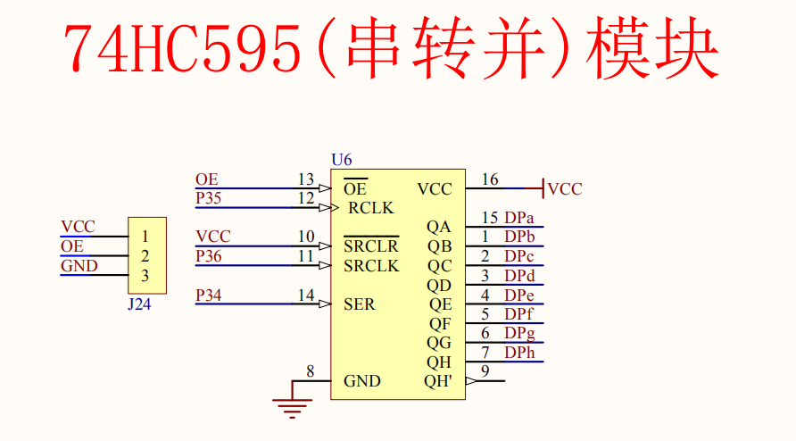

# [issue已解决。即接线问题](https://github.com/yujiecong/yjc-c51-A2-learning/issues/2)
将OE（output efficiency）接一个低电平的引脚即可，这里接的是P0^7  
## [这里我自己写了一个版本，显示单个流水灯的](main2.c)
只是稍微调整了一下逻辑结构即可
```
void main()
{
    LED = 0;
    ledNum = ~0xfd; //0000 0001
    init74HC595();
    while (1)
    {
        Hc595SendByte();
        ledNum = _crol_(ledNum, 1);
        if (ledNum == 0x01)
        {
            init74HC595();
        }
        delay(50000);
    }
}
```
## 怎么用这个74hc595呢？
首先我们要从原理图知道  
  
他是占用了5个io，分别是OE,P3.5,VCC,P3.6,P3.4来有效的输出了8个io口数据，所以真不错
那么，分别来说说引脚是什么意思..  
- OE上面已经提到过了，是输出有效的意思，即QA~QH的有效
- RCLK是 right CLOCK 的意思，即输出的时钟输入
- SRCLK 是shift right clock 的意思，即输入的右移时钟
- SER是当前位输入数据。

_上面的内容都是我自己猜的，如果有错误请指出_  
我们知道，很明显只有一个口存入74hc595，那么我们需要一个类似初始化的操作给这个芯片，让他能一直运行下去.  
就像这句话说的一样  
> )595是串入并出带有锁存功能移位寄存器，它的使用方法很简单，如下面的真值表，在正常使用时ST_CP为低电平， /OE为低电平。从DS每输入一位数据，串行输入时钟SH_CP上升沿有效一次，直到八位数据输入完毕，输出时钟ST_CP上升沿有效一次，此时，输入的数据就被送到了输出端。
```
	//这一个for循环的意思是把8位数据先存入74hc595
	for(a=0;a<8;a++)		 //发送8位数
	{
		//输出有效
		SER = dat >> 7;		 //从最高位开始发送
		dat <<= 1;

		SRCLK = 0;			 //发送时序
		//nop 的作用，产生一个几十微秒的脉冲产生上升沿
		_nop_();//相当于python的pass 或者说C语言的; 即空语句,在这里占用一个机器周期
		_nop_();//相当于python的pass 或者说C语言的; 即空语句,在这里占用一个机器周期
		SRCLK = 1;	
	}
	RCLK = 0;
```
那么，我们知道这个RCLK 和 SRCLK 都是上升沿有效，这意味着，需要一个 __状态的变化__ 也就是说需要一个类似这样的操作
```
		SRCLK = 0;			 //发送时序
		//nop 的作用，产生一个几十微秒的脉冲产生上升沿
		_nop_();//相当于python的pass 或者说C语言的; 即空语句,在这里占用一个机器周期
		_nop_();//相当于python的pass 或者说C语言的; 即空语句,在这里占用一个机器周期
		SRCLK = 1;	
```
才能让SRCLK一次有效，也就是让芯片进行一次移位！！   
后来的RCLK也是需要这样的操作！
```
	RCLK = 0;
	_nop_();//相当于python的pass 或者说C语言的; 即空语句,在这里占用一个机器周期
	_nop_();//相当于python的pass 或者说C语言的; 即空语句,在这里占用一个机器周期
	RCLK = 1;
```

## 下面的内容与原理图的不太一样，只做参考
那么，来介绍一下这个74HC595怎么用，[具体的资料可以看这里](74HC595芯片中文资料.pdf)
## 74595 的控制端说明：

/SCLR(10 脚): 低点平时将移位寄存器的数据清零。通常我将它接 Vcc。

SCK(11 脚)：上升沿时数据寄存器的数据移位。QA-->QB-->QC-->...-->QH；下
降沿移位寄存器数据不变。（脉冲宽度：5V 时，大于几十纳秒就行了。）

RCK(12 脚)：上升沿时移位寄存器的数据进入数据存储寄存器，下降沿时存储寄
存器数据不变。通常我将 RCK 置为低点平，当移位结束后，在 RCK 端产生一
个正脉冲（5V 时，大于几十纳秒就行了。我通常都选微秒级），更新显示数据

/G(13 脚): 高电平时禁止输出（高阻态）。如果单片机的引脚不紧张，用一个引
脚控制它，可以方便地产生闪烁和熄灭效果。比通过数据端移位控制要省时省力

## 74HC595 是具有 8 位移位寄存器和一个存储器，三态输出功能。 
移位寄存器和存储器是分别的时钟。  
数据在 SCHcp 的上升沿输入，在 STcp 的上升沿进入的存储寄存器中去。如果两个时钟连在一起，则移位寄存器总是比存储寄存器早一个脉冲。

移位寄存器有一个串行移位输入（Ds），和一个串行输出（Q7’）,和一个异步的低电平复位

存储寄存器有一个并行 8 位的，具备三态的总线输出，当使能 OE 时（为低电平），存储寄存器的数据输出到总线。

## 程序说明： 
每当 spi_shcp 上升沿到来时,spi_ds 引脚当前电平值在移位寄存器中左移一位，在下一个上升沿到来时移位寄存器中的所有位都会向左移一位， 

同时 Q7'也会串行输出移位寄存器中高位的值， 这样连续进行 8 次，就可以把数组中每一个数（8 位的数）送到移位寄存器； 

然后当 spi_stcp 上升沿到来时，移位寄存器的值将会被锁存到锁存器里，并从 Q1~7 引脚输出
