# EEPROM(IIC总线)[这里是基础知识铺垫，要是想看代码解析点这里](code.md)
## 前言
这里的内容有些难，当涉及到了通信原理的东西都蛮难的，哈哈哈不过还是有规律可寻  
我们要做的其实就是理解怎么用代码构建一个信号，让单片机可以操控别的“主机”罢了。
比如起始信号和终止信号就是用类似这样的代码发送给想要告诉的器件上的
```
（1）起始信号
Void I2CStart(void)
{       SDA = 1;
	SomeNop(  );
	SCL = 1;
	SomeNop(  );
	SDA = 0;
	SomeNop(  );
}

```
这里somenop代码 一些_nop_操作，用于延迟几个机器周期。我们想做的，不就是想控制一下这个
EEPROM而已，也就是一块小的存储器  
> (Electrically Erasable Programmable read only memory)是指带电可擦可编程只读存储器。是一种掉电后数据不丢失的存储芯片  

这一块单片机上用的是At24c02，即

> AT24C02是一个2K位串行CMOS E2PROM， 内部含有256个8位字节，CATALYST公司的先进CMOS技术实质上减少了器件的功耗。AT24C02有一个8字节页写缓冲器。该器件通过IIC总线接口进行操作，有一个专门的写保护功能。

那么，得先介绍一下怎么跟这个存储器通信！注意哦，这个所谓的IIC或者说I2C已经在我这个板子上了，所以这里只是说一下单片机的通信原理哈哈
## 1. IIC串行总线的组成及工作原理
采用串行总线技术可以使系统的硬件设计大大简化、系统的体积减小、可靠性提高。同时，系统的更改和扩充极为容易。

常用的串行扩展总线有： I2C （Inter IC BUS）总线、单总线（1－WIRE BUS）、SPI（Serial Peripheral Interface）总线及Microwire/PLUS等。 

__这里我们仅讨论I2C串行总线。__

I2C总线是PHLIPS公司推出的一种串行总线，是具备多主机系统所需的包括总线裁决和高低速器件同步功能的高性能串行总线。 

I2C总线只有两根双向信号线。一根是数据线SDA，另一根是时钟线SCL。  
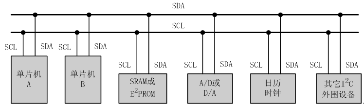  
I2C总线通过上拉电阻接正电源。当总线空闲时，两根线均为高电平。连到总线上的任一器件输出的低电平，都将使总线的信号变低，即各器件的SDA及SCL都是线“与”关系。  
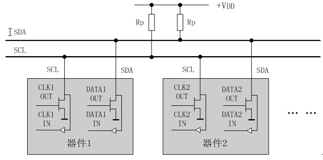  
每个接到I2C总线上的器件都有唯一的地址。主机与其它器件间的数据传送可以是由主机发送数据到其它器件，这时主机即为发送器。由总线上接收数据的器件则为接收器。

在多主机系统中，可能同时有几个主机企图启动总线传送数据。为了避免混乱， I2C总线要通过总线仲裁，以决定由哪一台主机控制总线。

__在80C51单片机应用系统的串行总线扩展中，我们经常遇到的是以80C51单片机为主机，其它接口器件为从机的单主机情况。__ 
### I2C总线的数据传送
#### 一、数据位的有效性规定
I2C总线进行数据传送时，时钟信号为高电平期间，数据线上的数据必须保持稳定，只有在时钟线上的信号为低电平期间，数据线上的高电平或低电平状态才允许变化。  
 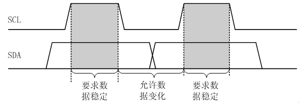  
#### 二、起始和终止信号
SCL线为高电平期间，SDA线由高电平向低电平的变化表示起始信号；SCL线为高电平期间，SDA线由低电平向高电平的变化表示终止信号。  
 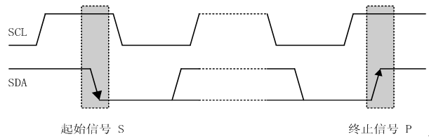  

起始和终止信号都是由主机发出的，在起始信号产生后，总线就处于被占用的状态；在终止信号产生后，总线就处于空闲状态。

连接到I2C总线上的器件，若具有I2C总线的硬件接口，则很容易检测到起始和终止信号。

接收器件收到一个完整的数据字节后，有可能需要完成一些其它工作，如处理内部中断服务等，可能无法立刻接收下一个字节，这时接收器件可以将SCL线拉成低电平，从而使主机处于等待状态。直到接收器件准备好接收下一个字节时，再释放SCL线使之为高电平，从而使数据传送可以继续进行。  
#### 三、数据传送格式
- （1）字节传送与应答
    - 每一个字节必须保证是8位长度。数据传送时，先传送最高位（MSB），每一个被传送的字节后面都必须跟随一位应答位（即一帧共有9位）。   
     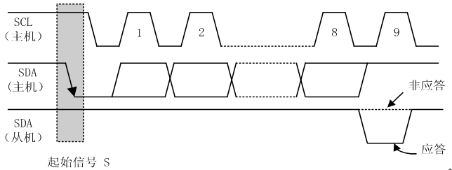  
    - 由于某种原因从机不对主机寻址信号应答时（如从机正在进行实时性的处理工作而无法接收总线上的数据），它必须将数据线置于高电平，而由主机产生一个终止信号以结束总线的数据传送。  
    - 如果从机对主机进行了应答，但在数据传送一段时间后无法继续接收更多的数据时，从机可以通过对无法接收的第一个数据字节的“非应答”通知主机，主机则应发出终止信号以结束数据的继续传送。

    - 当主机接收数据时，它收到最后一个数据字节后，必须向从机发出一个结束传送的信号。这个信号是由对从机的“非应答”来实现的。然后，从机释放SDA线，以允许主机产生终止信号。
- （2）数据帧格式
    - I2C总线上传送的数据信号是广义的，既包括地址信号，又包括真正的数据信号。
    - 在起始信号后必须传送一个从机的地址（7位），第8位是数据的传送方向位（R/T），用“0”表示主机发送数据（T），“1”表示主机接收数据（R）。
    - 每次数据传送总是由主机产生的终止信号结束。但是，若主机希望继续占用总线进行新的数据传送，则可以不产生终止信号，马上再次发出起始信号对另一从机进行寻址。 
    - 在总线的一次数据传送过程中，可以有以下几种组合方式：
        - a、主机向从机发送数据，数据传送方向在整个传送过程中不变：  
         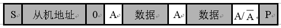  
         注：有阴影部分表示数据由主机向从机传送，无阴影部分则表示数据由从机向主机传送。
    A表示应答， A非表示非应答（高电平）。S表示起始信号，P表示终止信号。。
        - b、主机在第一个字节后，立即从从机读数据  
         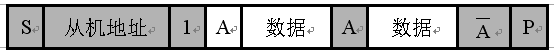  
        - c、在传送过程中，当需要改变传送方向时，起始信号和从机地址都被重复产生一次，但两次读/写方向位正好反相。  
        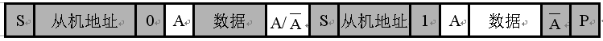  
#### 四、总线的寻址
I2C总线协议有明确的规定：采用7位的寻址字节（寻址字节是起始信号后的第一个字节）。
- 寻址字节的位定义  
    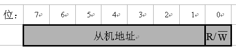  
    - D7～D1位组成从机的地址。D0位是数据传送方向位，为“0”时表示主机向从机写数据，为“1”时表示主机由从机读数据。

主机发送地址时，总线上的每个从机都将这7位地址码与自己的地址进行比较，如果相同，则认为自己正被主机寻址，根据R/T位将自己确定为发送器或接收器。

从机的地址由固定部分和可编程部分组成。在一个系统中可能希望接入多个相同的从机，从机地址中可编程部分决定了可接入总线该类器件的最大数目。

如一个从机的7位寻址位有4位是固定位，3位是可编程位，这时仅能寻址8个同样的器件，即可以有8个同样的器件接入到该I2C总线系统中。

__80C51单片机I2C串行总线器件的接口__  
其实说了这么多，就是铺垫而已，这涉及到通信之间的问题，还好吧，就是写代码怎么去写出来这种样子而已。
> 总线数据传送的模拟  
主机可以采用不带I2C总线接口的单片机，如80C51、AT89C2051等单片机，利用软件实现I2C总线的数据传送，即软件与硬件结合的信号模拟。 
### 一、典型信号模拟
为了保证数据传送的可靠性，标准的I2C总线的数据传送有严格的时序要求。I2C总线的起始信号、终止信号、发送“0”及发送“1”的模拟时序 ：   
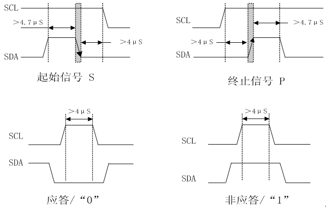  
### 二、典型信号模拟子程序
```
（1）起始信号
Void I2CStart(void)
{       SDA = 1;
	SomeNop(  );
	SCL = 1;
	SomeNop(  );
	SDA = 0;
	SomeNop(  );
}

```
```
（2）终止信号
void I2cStop(void)
{
	SDA = 0;
	SomeNop(  );
	SCL = 1;
	SomeNop(  );
	SDA = 1;
	SomeNop(  );
}

```

### I2C总线器件的扩展
一、扩展电路   
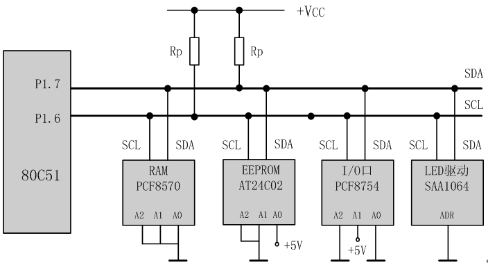  
#### 串行E2PROM的扩展 
（1）串行E2PROM典型产品  
ATMEL公司的AT24C系列：  

- AT24C01：128字节（128×8位）；
- AT24C02：256字节（256×8位）；
- AT24C04：512字节（512×8位）
- AT24C08：1K字节（1K×8位）；
- AT24C16：2K字节（2K×8位）； 

（2）写入过程
AT24C系列E2PROM芯片地址的固定部分为1010，A2、A1、A0引脚接高、低电平后得到确定的3位编码。形成的7位编码即为该器件的地址码。

单片机进行写操作时，首先发送该器件的7位地址码和写方向位“0”（共8位，即一个字节），发送完后释放SDA线并在SCL线上产生第9个时钟信号。被选中的存储器器件在确认是自己的地址后，在SDA线上产生一个应答信号作为相应，单片机收到应答后就可以传送数据了。

传送数据时，单片机首先发送一个字节的被写入器件的存储区的首地址，收到存储器器件的应答后，单片机就逐个发送各数据字节，但每发送一个字节后都要等待应答。

AT24C系列器件片内地址在接收到每一个数据字节地址后自动加1，在芯片的“一次装载字节数”（不同芯片字节数不同）限度内，只需输入首地址。装载字节数超过芯片的“一次装载字节数”时，数据地址将“上卷”，前面的数据将被覆盖。

当要写入的数据传送完后，单片机应发出终止信号以结束写入操作。写入n个字节的数据格式 ：

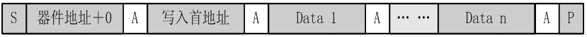  

### 移位操作
- 左移时最低位补0，最高位移入PSW的CY位
- 右移时最高位保持原数，最低位移除。

## AT24CXX存储器工作原理
### 特 点

* 与400KHz I2C总线兼容
* 1.8到6.0伏工作电压范围
* 低功耗CMOS技术
* 写保护功能当WP为高电平时进入写保护状态
* 页写缓冲器
* 自定时擦写周期
* 100万次编程/擦除周期
* 可保存数据100年
* 8脚DIP SOIC或TSSOP封装
* 温度范围商业级和工业级

### 概 述
CAT24WC01/02/04/08/16是一个1K/2K/4K/8K/16K位串行CMOS,EEPROM内部含有128/256/512/1024/2048个8位字节CATALYST公司的先进CMOS技术实质上减少了器件的功耗,CAT24WC01有一个8字节页写缓冲器CAT24WC02/04/08/16有一个16字节页写缓冲器,该器件通过I2C总线接口进行操作有一个专门的写保护功能
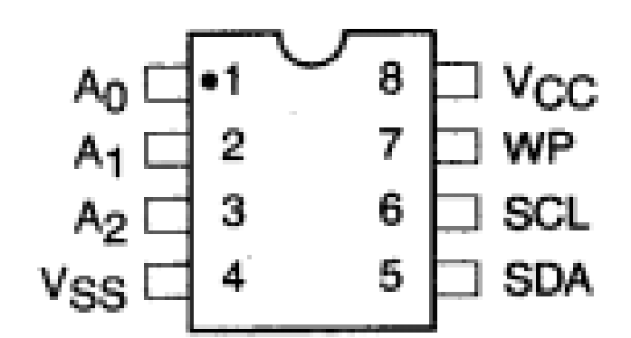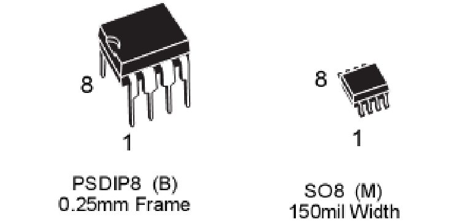  
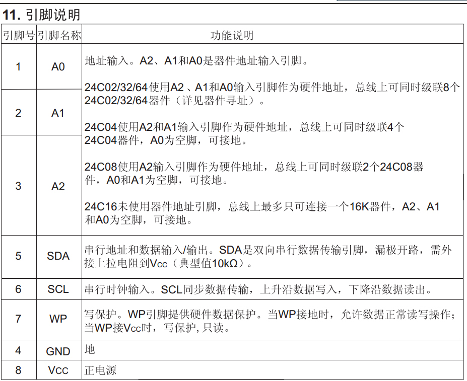

#### 总线时序
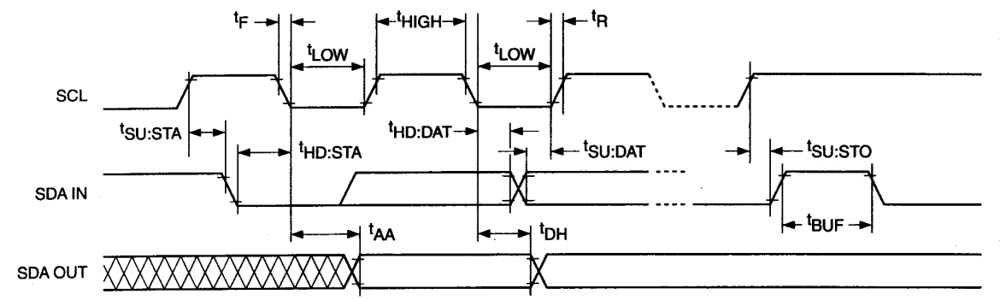  
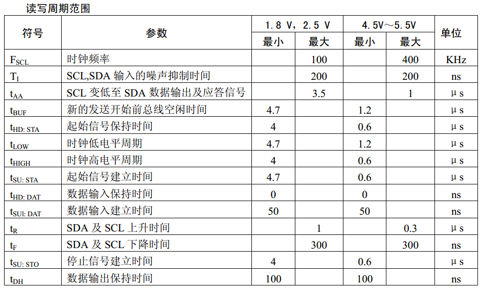  
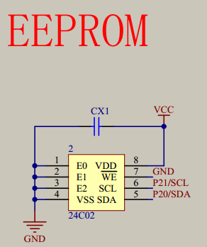
