# DS18B20温度传感器原理
## 前言
有了之前那个EEPROM-IIC的经验，是不是感觉还行？那么来个更难的.  
这个DS18B20是一堆电子元件的集合体，有存储器，有温度传感器，有触发器，有寄存器，还有特定的CRC生成器。  
所以用起来就比较麻烦了。。  
首先是温度传感器获得的数据会存进一个温度寄存器里，然后我们 需要读这个寄存器的数据出来再使用。  
但在这之前，需要初始化这个ds18b20.所以流程为
### 1. 初始化ds18b20
详细情看[这里](#七.DS18B20初始化)
```
uchar Ds18b20Init()
{
	uchar i;
	DSPORT = 0;			 //将总线拉低480us~960us
	i = 70;	
	while(i--);//延时642us
	DSPORT = 1;			//然后拉高总线，如果DS18B20做出反应会将在15us~60us后总线拉低
	i = 0;
	while(DSPORT)	//等待DS18B20拉低总线
	{
		Delay1ms(1);
		i++;
		if(i>5)//等待>5MS
		{
			return 0;//初始化失败
		}
	
	}
	return 1;//初始化成功
}

```
### 2. 发送信号，表示需要读取数据(写操作)
详细看[这里](#九.DS18B20写时序)
一次读1位，读八位
```
void Ds18b20WriteByte(uchar dat)
{
	uint i, j;

	for(j=0; j<8; j++)
	{
		DSPORT = 0;	     	  //每写入一位数据之前先把总线拉低1us
		i++;
		DSPORT = dat & 0x01;  //然后写入一个数据，从最低位开始
		i=6;
		while(i--); //延时68us，持续时间最少60us
		DSPORT = 1;	//然后释放总线，至少1us给总线恢复时间才能接着写入第二个数值
		dat >>= 1;
	}
}
```
### 3. 读取温度寄存器数据
详细看[这里](#八.DS18B20读时序)
一次只能读8位
```
uchar Ds18b20ReadByte()
{
	uchar byte, bi;
	uint i, j;	
	for(j=8; j>0; j--)
	{
		DSPORT = 0;//先将总线拉低1us
		i++;
		DSPORT = 1;//然后释放总线
		i++;
		i++;//延时6us等待数据稳定
		bi = DSPORT;	 //读取数据，从最低位开始读取
		/*将byte左移一位，然后与上右移7位后的bi，注意移动之后移掉那位补0。*/
		byte = (byte >> 1) | (bi << 7);						  
		i = 4;		//读取完之后等待48us再接着读取下一个数
		while(i--);
	}				
	return byte;
}
```
## 一. DS18B20简介
DS18B20数字温度传感器接线方便，封装后可应用于多种场合，如管道式，螺纹式，磁铁吸附式，不锈钢封装式。主要根据应用场合的不同而改变其外观。封装后的DS18B20可用于电缆沟测温，高炉水循环测温，锅炉测温，机房测温，农业大棚测温，洁净室测温，弹药库测温等各种非极限温度场合。耐磨耐碰，体积小，使用方便，封装形式多样，适用于各种狭小空间设备数字测温和控制领域。
## 二. DS18B20的特点
1. 适应电压范围更宽，电压范围：3.0～5.5V，在寄生电源方式下可由数据线供电
2. 独特的单线接口方式，DS18B20在与微处理器连接时仅需要一条口线即可实现微处理器与DS18B20的双向通讯。
3. DS18B20支持多点组网功能，多个DS18B20可以并联在唯一的三线上，实现组网
   多点测温。
4. DS18B20在使用中不需要任何外围元件，全部传感元件及转换电路集成在形如一
   只三极管的集成电路内。
5. 温范围－55℃～+125℃，在-10～+85℃时精度为±0.5℃
6. 可编程的分辨率为9～12位，对应的可分辨温度分别为0.5℃、0.25℃、0.125℃
   和0.0625℃，可实现高精度测温。
7. 在9位分辨率时最多在93.75ms内把温度转换为数字，12位分辨率时最多在750ms
   内把温度值转换为数字，速度更快。
8. 测量结果直接输出数字温度信号，以"一根总线"串行传送给CPU，同时可传送
   CRC校验码，具有极强的抗干扰纠错能力。
9. 负压特性：电源极性接反时，芯片不会因发热而烧毁， 但不能正常工作。 
## 三. DS18B20实物图 
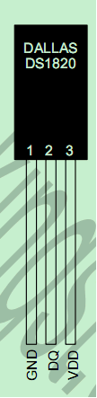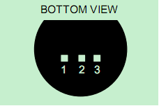
## 四. DS18B20的内部结构
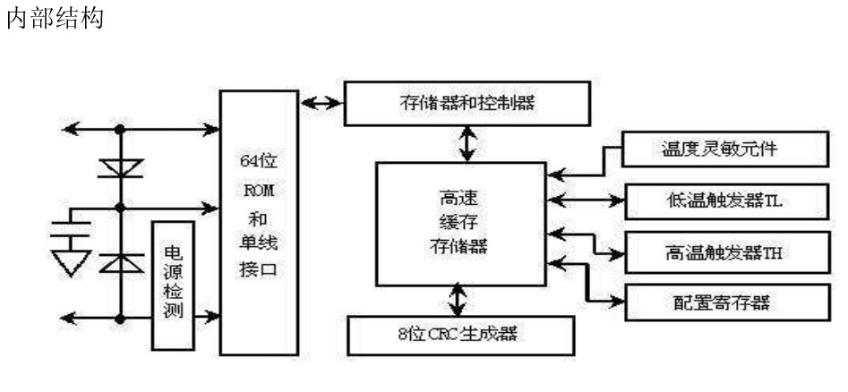  
### (1) 64位(激)光刻只读存储器
光刻ROM中的64位序列号是出厂前被光刻好的，它可以看作是该DS18B20的地址序列号。64位光刻ROM的排列是：开始8位（28H）是产品类型标号，接着的48位是该DS18B20自身的序列号，最后8位是前面56位的循环冗余校验码。光刻ROM的作用是使每一个DS18B20都各不相同，这样就可以实现一根总线上挂接多个DS18B20的目的。  
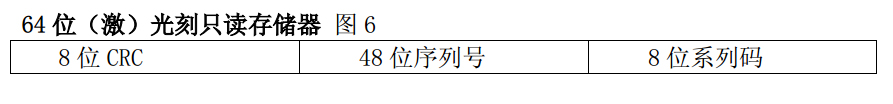   
### (2) DS18B20温度转换规则
DS18B20的核心功能是它可以直接读出数字的温度数值。温度传感器的精度为用户可编程的9，10，11或12位，分别以0.5℃，0.25℃，0.125℃和0.0625℃增量递增。在上电状态下默认的精度为12位。

DS18B20启动后保持低功耗等待状态,当需要执行温度测量和AD转换时，总线控制器必须发出[44h]命令。转换完以后，产生的温度数据以两个字节的形式被存储到高速暂存器的温度寄存器中，DS18B20继续保持等待状态。  
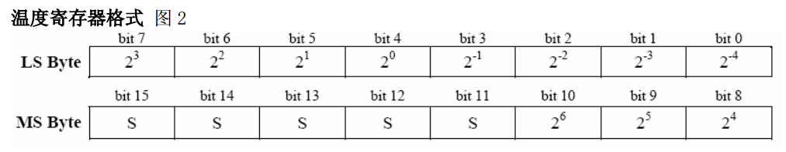   
这是12位转化后得到的12位数据，存储在DS18B20的两个8位的RAM中，高字节的前5位是符号位，如果测得的温度大于0，这5位为‘0’，只要将测到的数值乘以0.0625即可得到实际温度；如果温度小于0，这5位为‘1’，测到的数值需要先减1再取反再乘以0.0625即可得到实际温度。  
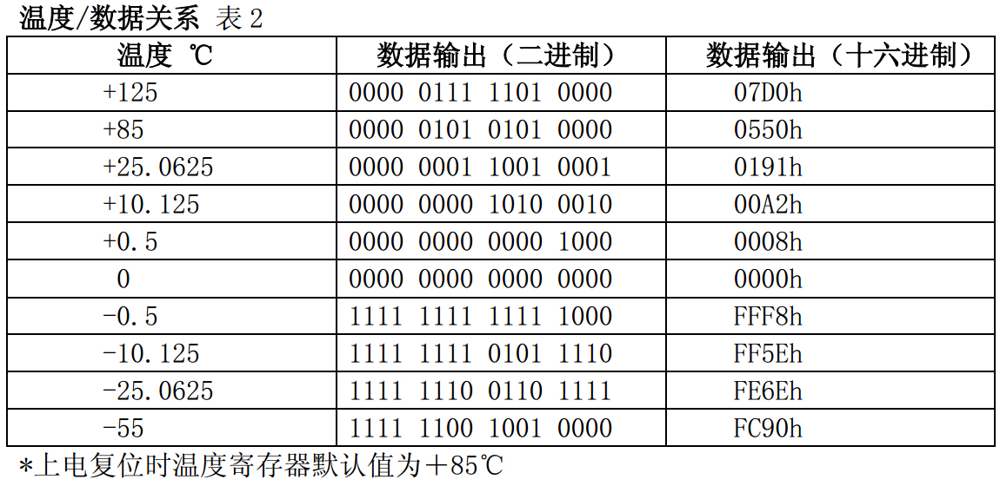   
### (3) DS18B20温度传感器的存储器
DS18B20温度传感器的内部存储器包括一个高度的暂存器RAM和一个非易失性的可电擦除的EEPROM,后者存放高温度和低温度触发器TH、TL和结构寄存器。

### (4) 配置寄存器
存储器的第4位为配置寄存器，其组织见图8，用户可按表3所示设置R0和R1位来设定DS18B20的精度。上电默认设置：R0=1、R1=1(12位精度)。注意：精度和转换时间之间有直接的关系。暂存器的位7和位0-4被器件保留，禁止写入。  
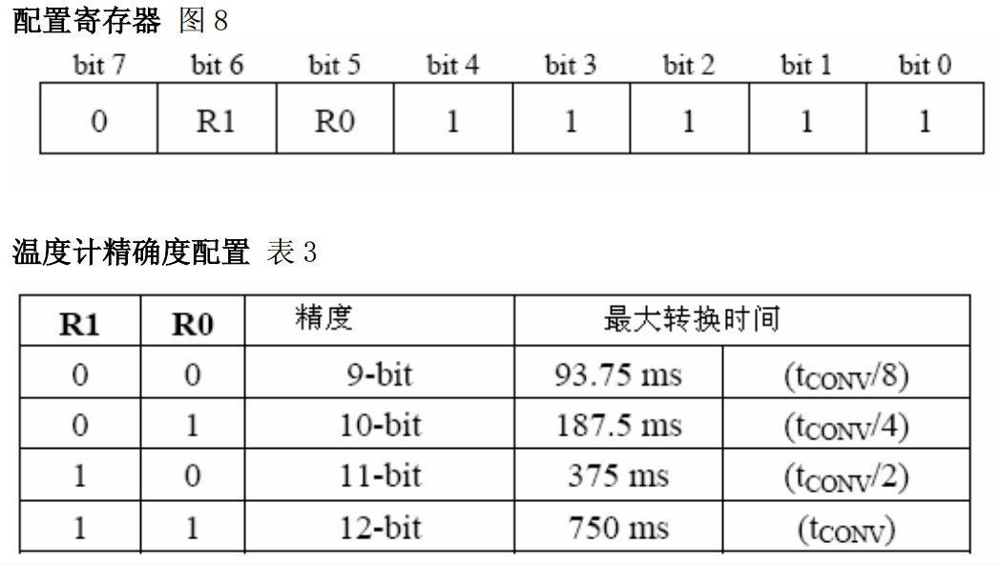  
## 五. DS18B20的ROM指令表
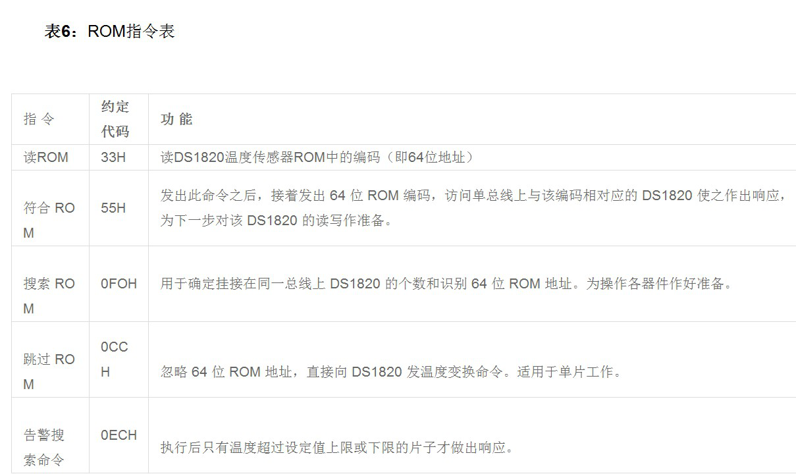  
## 六. DS18B20的RAM指令表
  
## 七.DS18B20初始化
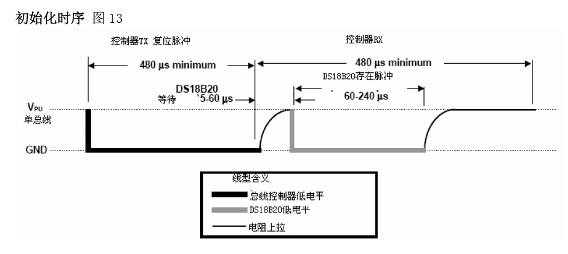  
(1).数据线拉到低电平“0”。

(2).延时480微妙（该时间的时间范围可以从480到960微妙）。

(3).数据线拉到高电平“1”。

(4).延时等待80微妙。如果初始化成功则在15到60微妙时间内产生一个由DS18B20所返回的低电平“0”.根据该状态可以来确定它的存在，但是应注意不能无限的进行等待，不然会使程序进入死循环，所以要进行超时判断。

(5).若CPU读到了数据线上的低电平“0”后，还要做延时，其延时的时间从发出的高电平算起（第（3）步的时间算起）最少要480微妙。
## 八.DS18B20读时序
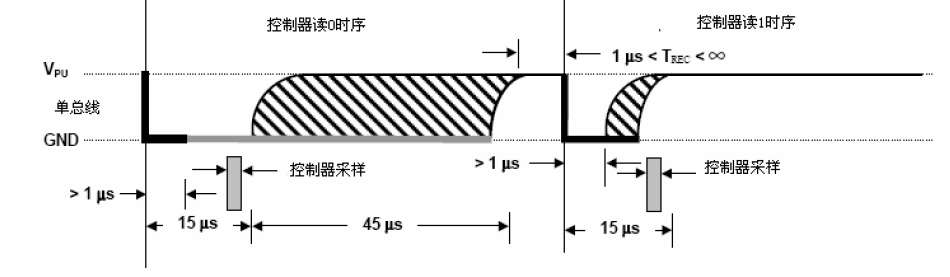   
(1).将数据线拉低“0”。

(2).延时1微妙。

(3).将数据线拉高“1”,释放总线准备读数据。

(4).延时10微妙。

(5).读数据线的状态得到1个状态位，并进行数据处理。

(6).延时45微妙。

(7).重复1～7步骤，直到读完一个字节。
## 九.DS18B20写时序
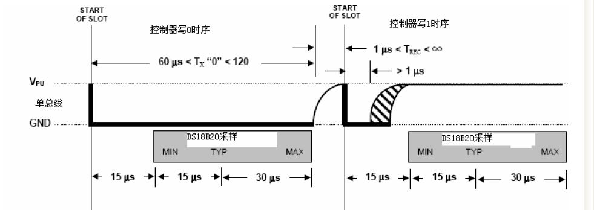   
(1).数据线先置低电平“0”

(2).延时15微妙。

(3).按从低位到高位的顺序发送数据(一次只发送一位)。

(4).延时60微妙。

(5).将数据线拉到高电平。

(6).重复1～5步骤，直到发送完整的字节。

(7).最后将数据线拉高。

   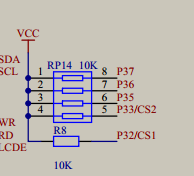   
