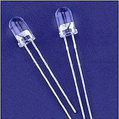
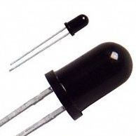
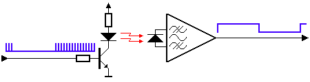
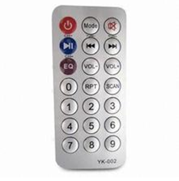
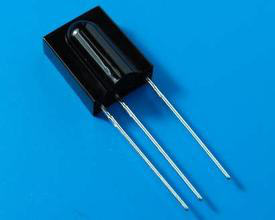
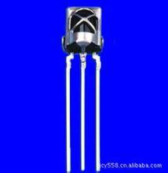
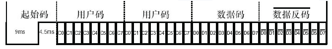
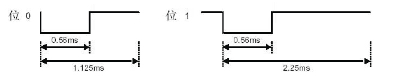

# 红外通信
## 一. 什么是红外线
> 人的眼睛能看到的可见光按波长从长到短排列，依次为红、橙、黄、绿、青、蓝、紫。其中红光的波长范围为0.62～0.76μm；紫光的波长范围为0.38～0.46μm。比紫光波长还短的光叫紫外线，比红光波长还长的光叫红外线.红外线遥控就是利用波长为0.76～1.5μm之间的近红外线来传送控制信号的。

## 二. 红外线系统的组成
红外线遥控器已被广泛使用在各种类型的家电产品上，它的出现给使用电器提供了很多的便利。红外线系统一般由红外发射装置和红外接收设备两大部分组成。  
红外发射装置又可由键盘电路、红外编码芯片、电源和红外发射电路组成。红外接收设备可由红外接收电路、红外解码芯片、电源和应用电路组成。  
通常为了使信号更好的被发射端发送出去，经常会将二进制数据信号调制成为脉冲信号，通过红外发射管发射。常用的有通过脉冲宽度来实现信号调制的脉宽调制(PWM)和通过脉冲串之间的时间间隔来实现信号调制的脉时调制(PPM)两种方法。
## 三. 红外发射管
红外遥控发射装置，也就是通常我们说的红外遥控器是由键盘电路、红外编码电路、电源电路和红外发射电路组成。红外发射电路的主要元件为红外发光二极管。它实际上是一只特殊的发光二极管；由于其内部材料不同于普通发光二极管，因而在其两端施加一定电压时，它便发出的是红外线而不是可见光。目前大量的使用的红外发光二极管发出的红外线波长为940nm左右，外形与普通φ5发光二极管相同。

## 四. 红外遥控器发射
通常红外遥控为了提高抗干扰性能和降低电源消耗，红外遥控器常用载波的方式传送二进制编码，常用的载波频率为38kHz，这是由发射端所使用的455kHz晶振来决定的。在发射端要对晶振进行整数分频，分频系数一般取12，所以455kHz÷12≈37.9kHz≈38kHz。

也有一些遥控系统采用36kHz、40 kHz、56 kHz等，一般由发射端晶振的振荡频率来决定。所以，通常的红外遥控器是将遥控信号（二进制脉冲码）调制在38KHz的载波上，经缓冲放大后送至红外发光二极管，转化为红外信号发射出去的。

二进制脉冲码的形式有多种，其中最为常用的是PWM码（脉冲宽度调制码）和PPM码（脉冲位置调制码，脉冲串之间的时间间隔来实现信号调制）。如果要开发红外接收设备，一定要知道红外遥控器的编码方式和载波频率，我们才可以选取一体化红外接收头和制定解码方案。  
发射端接收端
### 遥控器

## 五. 红外线接收
红外接收设备是由红外接收电路、红外解码、电源和应用电路组成。红外遥控接收器的主要作用是将遥控发射器发来的红外光信好转换成电信号，再放大、限幅、检波、整形，形成遥控指令脉冲，输出至遥控微处理器。  
近几年不论是业余制作还是正式产品，大多都采用成品红外接收头。成品红外接收头的封装大致有两种：一种采用铁皮屏蔽；一种是塑料封装。均有三只引脚，即电源正（VDD）、电源负（GND）和数据输出（VOUT）。在使用时注意成品红外接收头的载波频率,另外在遥控编码芯片输出的波形与接收头端收到的波形。  

## 六.数据格式
数据格式包括了引导码、用户码、数据码和数据码反码，编码总占32位。数据反码是数据码反相后的编码，编码时可用于对数据的纠错。注意：第二段的用户码也可以在遥控应用电路中被设置成第一段用户码的反码。

## 七. 位定义
用户码或数据码中的每一个位可以是位 ‘1’ ，也可以是位 ‘0’。区分 ‘0’和 ‘1’是利用脉冲的时间间隔来区分，这种编码方式称为脉冲位置调制方式，英文简写PPM  

# 原理图

