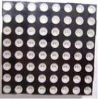
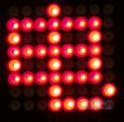
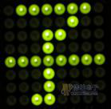
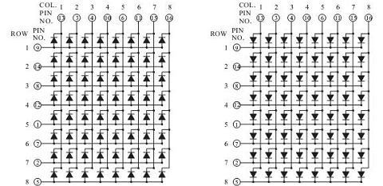
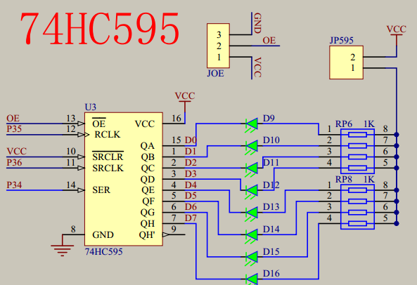
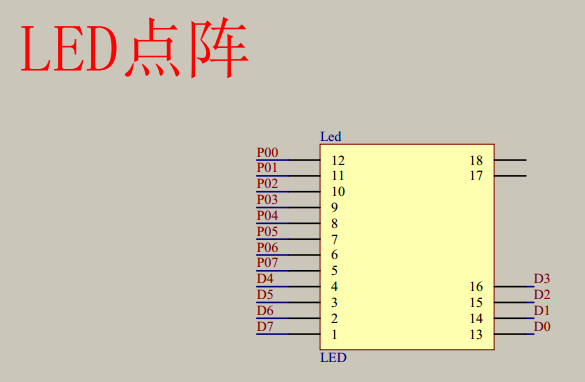

# 8*8LED点阵实验

## 注意
P0为低电平段选，而8x8的led是高电平有效
## Precondition
U SHOULD UNDERSTAND PERVIOUS CHAPTER ([SEE THIS](https://github.com/yujiecong/yjc-c51-A2-learning/tree/master/contents/%E5%AE%9E%E9%AA%8C8%EF%BC%9A%E5%8D%95%E7%89%87%E6%9C%BAIO%E6%89%A9%E5%B1%95--74HC595))
## 1. 8×8LED点阵的原理
  

  

  
真不错，多看看原理图很多事情就都明白了。
74HC595和8x8是连在一起的，这意味着前者控制后者的输出，注意到8x8点阵还被P0控制，那么P0就是控制第几列的，真不错，那么如果理解了[#预备知识](#Precondition)后很容易懂了
## 2. 8×8LED点阵的动态显示
真不错,从左到右数呗，多看看原理图,用一个二维的关系 来显示数字，只要变一下就能得到很多结果
```
void Hc595SendByte(u8 dat1,u8 dat2)
{
	u8 a;

	SRCLK = 1;
	RCLK = 1;

	for(a=0;a<8;a++)		 //发送8位数
	{
		SER = dat1 >> 7;		 //从最高位开始发送
		dat1 <<= 1;

		SRCLK = 0;			 //发送时序
		_nop_();
		_nop_();
		SRCLK = 1;	
	}

	for(a=0;a<8;a++)		 //发送8位数
	{
		SER = dat2 >> 7;		 //从最高位开始发送
		dat2 <<= 1;

		SRCLK = 0;			 //发送时序
		_nop_();
		_nop_();
		SRCLK = 1;	
	}

	RCLK = 0;
	_nop_();
	_nop_();
	RCLK = 1;
}


```
## 3. 74HC595芯片介绍
[具体查看上一章](https://github.com/yujiecong/yjc-c51-A2-learning/tree/master/contents/%E5%AE%9E%E9%AA%8C8%EF%BC%9A%E5%8D%95%E7%89%87%E6%9C%BAIO%E6%89%A9%E5%B1%95--74HC595)
